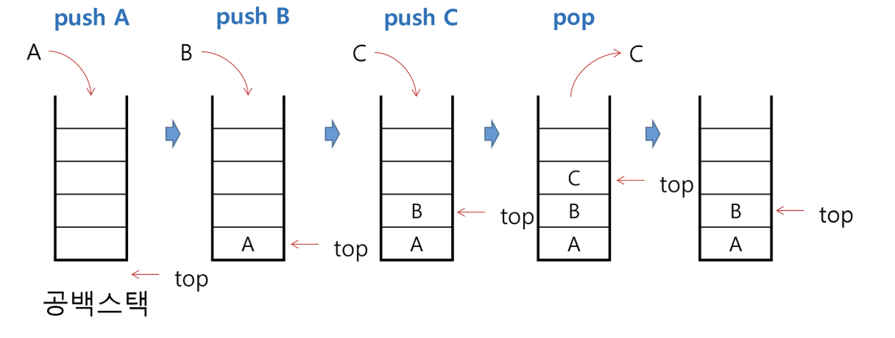

## 스택
### 스택(stack)의 특성
- 물건을 쌓아 올리듯 자료를 쌓아 올린 형태의 자료구조임
- 스택에 저장된 자료는 선형 구조를 가짐
    - 선형구조: 자료 간의 관계가 1대1의 관계를 가짐
    - 비선형구조: 자료 간의 관계가 1대N의 관계를 가짐 (예: 트리)
- 스택에 자료를 삽입하거나 스택에서 자료를 꺼낼 수 있음
- 마지막에 삽입한 자료를 가장 먼저 꺼냄
    - 후입선출(LIFO, Last-In-First-Out)
    - 예를 들어 스택에 1,2,3 순으로 자료를 삽입한 후 꺼내면 역순으로 즉 3,2,1 순으로 꺼낼 수 있음

### 스택을 프로그램에서 구현하기 위해서 필요한 자료구조와 연산
- 자료구조: 자료를 선형으로 저장할 저장소
    - 배열을 사용할 수 있음
    - 저장소 자체를 스택이라 부르기도 함
    - 스택에서 마지막 삽입된 원소의 위치를 top이라 부름 
- 연산
    - 삽입: 저장소에 자료를 저장함. 보통 push라고 부름
    - 삭제: 저장소에서 자료를 꺼냄. 꺼낸 자료는 삽입한 자료의 역순으로 꺼냄. 보통 pop이라 부름
    - 스택이 공백인지 아닌지를 확인하는 연산. isEmpty
    - 스택의 top에 있는 item(원소)을 반환하는 연산. peek    

### 스택의 삽입/삭제 과정
- 빈 스택에 원소 A,B,C를 차례로 삽입 후 한번 삭제하는 연산과정

### 스택의 push 알고리즘
- append 메소드를 통해 리스트의 마지막에 데이터를 삽입
~~~python
def push(item):
    s.append(item)
~~~

### 스택의 구현
~~~python
def push(item, size):
    global top
    top += 1
    if top == size:
        print("overflow!")
    else:
        stack[top] = item

size = 10
stack = [0] * size
top -= 1

push(10, size)
top += 1            # puush(20)
stack[top] = 20
~~~

### 스택의 pop 알고리즘
~~~python
def pop():
    if len(s) == 0:
        # underflow
        return
    else:
        return s.pop()
~~~

~~~python
def pop():
    global top
    if top == -1:
        print("underflow")
        return 0
    else:
        top -= 1
        return stack[top+1]

print(pop())

if top > -1:  # pop()
    top -= 1
    print(stack[top+1])
~~~

### 스택 구현 고려 사항
- 1차원 배열을 사용하여 구현할 경우 구현이 용이하다는 장점이 있지만 스택의 크기를 변경하기가 어렵다는 단점이 있음

- 이를 해결하기 위한 방법으로 저장소를 동적으로 할당하여 스택을 구현하는 방법이 있음. 동적 연결리스트를 이용하여 구현하는 방법을 의미함. 구현이 복잡하다는 단점이 있지만 메모리를 효율적으로 사용한다는 장점을 가짐. 스택의 동적 구현은 생략함