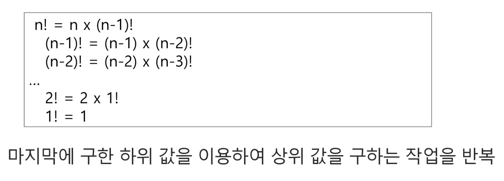

## 재귀호출
- 필요한 함수가 자신과 같은 경우 자신을 다시 호출하는 구조
- 함수에서 실행해야 하는 작업의 특성에 따라 일반적인 호출방식보다 재귀호출방식을 사용하여 함수를 만들면 프로그램의 크기를 줄이고 간단하게 작성
    - 재귀 호출의 예) Factorial

### Factorial
- n에 대한 factorial: 1부터 n까지의 모든 자연수를 곱하여 구하는 연산

- factorial 함수에서 n=4인 경우의 실행

