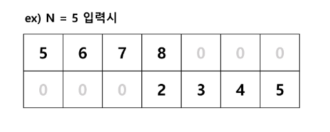
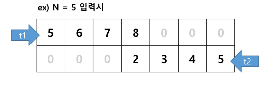

## SW 문제 해결
### SW 문제 해결 역량이란 무엇인가?
- 프로그램을 하기 위한 많은 제약 조건과 요구사항을 이해하고 최선의 방법을 찾아내는 능력
- 프록그래머가 사용하는 언어나 라이브러리, 자료구조, 알고리즘에 대한 지식을 적재적소에 퍼즐을 배치하듯 이들을 연결하여 큰 그림을 만드는 능력이라 할 수 있음
- 문제 해결 역량은 추상적인 기술
  - 프로그래밍 언어, 알고리즘처럼 명확히 정의된 실체가 없음
  - 무작정 알고리즘을 암기하고 문제를 풀어본다고 향상되지 않음
- 문제 해결 역량을 향상시키기 위해서 훈련이 필요함

### 문제 해결 과정
1. 문제를 읽고 이해한다.
2. 문제를 익숙한 용어로 재정의한다.
3. 어떻게 해결할지 계획을 세운다.
4. 계획을 검증한다.
5. 프로그램으로 구현한다.
6. 어떻게 풀었는지 돌아보고, 개선할 방법이 있는지 찾아본다.

#### 리스트에 숫자 넣기
1. 수 N을 입력 받는다.
2. 윗 줄에는 N부터 1씩 증가되는 숫자 4개 왼쪽에 채운다.
3. 아랫 줄에는 N부터 1씩 감소되는 숫자 4개 오른쪽에 채운다.
4. 최종 결과를 출력한다. 빈 공간은 0으로 출력한다.

#### 설계 예시
1. 2 x 7 크기의 0으로 채운 리스트를 준비한다.
2. 수 N을 입력 받는다.
3. t1 = N 대입 후, for 4번 돌려 T1 값을 리스트에 넣는다. range(0, 4)
4. t2 = N 대입 후, for 4번 돌려 T2 값을 리스트에 넣는다. range(6, 2, -1)
5. 리스트 출력

