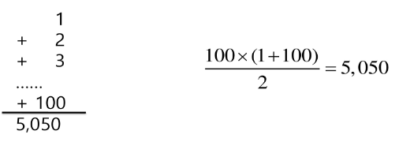
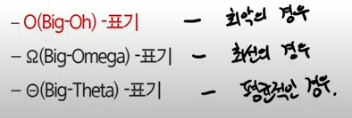
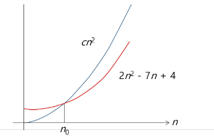
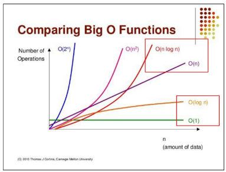
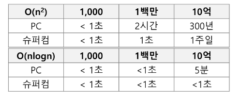

## 복잡도 분석
### 알고리즘?
- (명) 알고리즘: 유한한 단계를 통해 문제를 해결하기 위한 절차나 방법
  - 주로 컴퓨터용어로 쓰이며, 컴퓨터가 어떤 일을 수행하기 위한 단계적 방법을 말함
- 간단하게 다시 말하면 어떠한 문제를 해결하기 위한 절차라고 볼 수 있음
- 예를 들어 1부터 100까지의 합을 구하는 문제를 생각해 보자


### 알고리즘의 효율
- 공간적 효율성과 시간적 효율성
  - 공간적 효율성은 연산량 대비 얼마나 적은 메모리 공간(얼마나 적은 변수, 리스트 길이 등등)을 요하는 가를 말함
  - 시간적 효율성은 연산량 대비 얼마나 적은 시간(연산 횟수)을 요하는 가를 말함
  - 효율성을 뒤집어 표현하면 복잡도(Complexity)가 됨
    - 복잡도가 높을 수록 효율성은 저하됨

### 복잡도의 점근적 표기
- 시간 (또는 공간)복잡도는 입력 크기에 대한 함수로 표기하는데, 이 함수는 주로 여러 개의 항을 가지는 다항식임
- 이를 단순한 함수로 표현하기 위해 점근적 표기(Asymptotic Notation)를 사용함
- 입력 크기 n이 무한대로 커질 때의 복잡도를 간단히 표현하기 위해 사용하는 표기법임
    

### O(Big-Oh) 표기
- O-표기는 복잡도의 점근적 상한을 나타냄
- 복잡도가 f(n) = 2n^2^-7n+4 이라면, f(n)의 O-표기는 O(n^2)임
- 먼저 f(n)의 단순화된 표현은 n^2^임
- 단순화된 함수 n^2^에 임의의 상수 c를 곱한 cn^2^이 n이 증가함에 따라 f(n)의 상한이 됨 (단, c>0)


### 빅오표기법으로 표현하면?
```python
n = int(input())

for i in range(n):
    print(i, end=" ")

for i in range(n):
    print(i, end=" ")

for i in range(n):
    print(i, end=" ")
```
=> O(n)

```python
n = int(input())

for i in range(n):
    for x in range(n):
        print(i, end=" ")

    for y in range(n):
        print(i, end=" ")
```

=> O(n^2^)

### 상수 횟수 반복하는 코드는 빅오표기법으로 어떻게 표현할까?
```python
n = int(input())

for i in range(50):
    print(i)
```

=> O(1)

### 빅오표기법을 이렇게 표현하기도 함
- O(5N)
  - 5 배수 강조해서 표현하고 싶을 때, o(N)이라고 적지 않고, O(5N) 이라고 적곤 함

### 자주 사용하는 O-표기
- O(1): 상수 시간(Constant time)
- O(log n): 로그(대수) 시간(Logarithmic time)
- O(n): 선형 시간(Linear time)
- O(nlogn): 로그 선형 시간(Log-linear time)
- O(n^2^): 제곱 시간(Quadratic time)
- O(n^3^): 세제곱 시간(Cubic time)

### O(N) 이해하기
- 만약 N이 10,000 이고 O(N)으로 짠 알고리즘이 있다면, 몇 번 반복하는 프로그램이라고 추정해도 될까?
    => 10,000회

- 만약 N이 10,000 이고 O(N^2^)으로 짠 알고리즘이 있다면, 몇 번 반복하는 프로그램이라고 추정해도 될까?
    => 10,000 x 10,000 = 100,000,000 (1억)

### 만약 O(log N) 라면?
- 만약 N이 10,000 이고 O(log N)으로 짠 알고리즘이 있다면, 몇 번 반복하는 프로그램이라고 추정해도 될까?
- 알고리즘 이론에서 Log의 밑수는 10이 아니라 2이다.
  - 따라서, 2의 몇 승이 10,000이 되는지 계산기를 사용해서 알 수 있음

### O(logN)은 O(1)보다는 느리지만, 유사한 성능을 보인다고 결론을 낼 수 있음

### O(NlogN)은 O(N)보다는 느리지만, 유사한 성능을 보인다고 결론을 낼 수 있음


### 정리
- 왜 효율적인 알고리즘이 필요한가
  - 10억 개의 숫자를 정렬하는데 PC에서 O(n^2^) 알고리즘은 300여 년이 걸리는 반면에 O(nlogn) 알고리즘은 5분 만에 정렬함
    

  - 효율적인 알고리즘은 슈퍼컴퓨터보다 더 큰 가치가 있음
  - 값 비싼 H/W의 기술 개발보다 효율적인 알고리즘 개발이 훨씬 더 경제적임