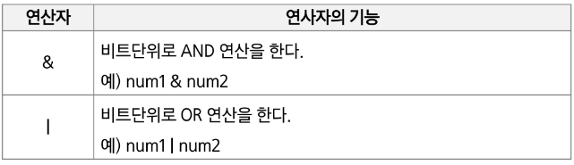
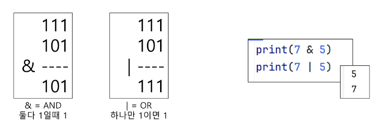
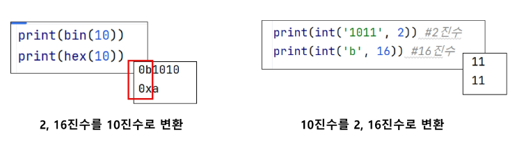
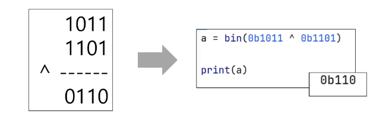
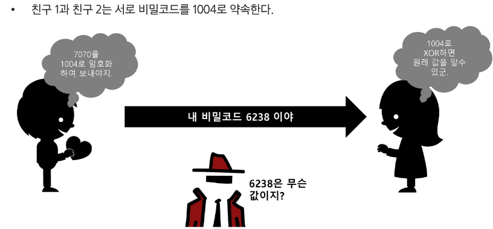

## 비트 연산
### 비트와 바이트
- 1 bit: 0과 1을 표현하는 정보의 단위
- 1 Byte: 8-bit를 묶어 1 Byte라고 함
#### 예시
- 1001011011011100은 총 몇 비트이면서, 몇 바이트인가?
    => 16bit -> 2bytes
  
### 비트연산
- 컴퓨터의 CPU는 0과 1로 다루어 동작되며, 내부적으로 비트 연산을 사용하여 덧셈, 뺄셈, 곱셈 등을 계산함

### 비트연산 챕터의 목적
- 사람이 사용하는 사칙연산 (+, *, /, -)이 아닌 컴퓨터가 사용하는 연산인 "비트연산"을 이해
- 더 나아가, 프로그래밍에서 비트연산을 활용한 코딩 방법을 익힘

### AND와 OR 비트연산자 이해하기
- a AND b: a, b 둘 다 1일때만 결과가 1. 그 외에는 0
- a OR b: a, b 둘중 하나만 1이면 결과가 1. 그 외에는 0

### 파이썬 구현
- 7 & 5 -> 이진수로 표현하면 0b111 & 0b101

  
### 파이썬에서 2진수, 16진수, 10진수 변환하여 출력하기
- 2진수는 숫자 0과 소문자 b -> 0b를 접두사를 붙여 표현
- 16진수 숫자 0과 소문자 x -> 0x를 접두사로 붙여 표현

### 비트 연산 파이썬으로 구현
~~~python
print(bin(10))  # 0b1010
print(hex(10))  # 0xa

# 2진수
print(int('1011', 2))  # 11

# 16진수
print(int('b', 16))  # 11
~~~

### XOR와 NOT 연산자
- ^: XOR 연산자, OR 처럼 동작되는데 둘 다 1인 경우는 0임
- 같으면 0 다르면 1

  
### 신기한 XOR
- 어떤 값이던 특정 수로 2회 XOR를 하면 원래 수로 돌아옴
    - 7070 ^ 1004 = 6528
    - 6258 ^ 1004 = 7070
    
### 암호화에 사용되는 XOR

### 비트 연산자
- Left Shift <<: 특정 수 만큼 비트를 왼쪽으로 밀어냄 (왼쪽 갈 때가 없으면 오른쪽에 0이 추가됨)
- Right Shift >>: 특정 수 만큼 비트를 오른쪽으로 밀어냄 (오른쪽 갈 때가 없으면 비트 삭제)
~~~python
print(bin(0b1101 << 2))  # 0b110100
print(bin(0b1101 >> 2))  # 0b11
~~~

### 비트연산 응용 1
- 1 << n
    - 2n의 값을 가짐
    - 임베디드 분야에서 계산을 빠르게 하기 위해 사용
    - 부분 집합을 구할 때도 사용 가능
    
- 1 & (1 << n)
    - i의 n번째 비트가 1인지 아닌지를 확인할 수 있음
    - ex) 1101 & (1 << 2)
        1101에서 2번 bit가 1인지 확인 가능 (결괏값 = 0100)
        결괏값이 0보다 크면 n번째 비트는 1임이 확정됨

