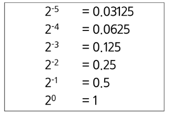

## 실수
### 파이썬에서 실수 출력 방법
- 파이썬은 f-string 문법을 지향함
~~~python
t1 = 10
t2 = 3.141592

print(f'변수 값은 {t1} 입니다.')  # 변수 값은 10 입니다.
print(f'변수 값은 {t2} 입니다.')  # 변수 값은 3.141592 입니다.
~~~

### 소수점 출력 방법
- {t2:.2f}: t2 값을 소수점 둘째자리에서 반올림하여 표현
~~~python
t1 = 10
t2 = 3.141592

print(f'변수 값은 {t1} 입니다.')  # 변수 값은 10 입니다.
print(f'변수 값은 {t2:.2f} 입니다.')  # 변수 값은 3.14 입니다.
~~~

### 파이썬에서의 실수 표현 범위를 알아보자
- 파이썬에서는 다른 언어와 달리 내부적으로 더 큰 규모의 자료구조를 사용해서 훨씬 넓은 범위의 실수를 표현할 수 있음
- 최대로 표현할 수 있는 값은 약 1.8 x 10308이고 이 이상은 inf로 표현
  (참고로 1억은 1 x 108)
- 최소로 표현할 수 있는 값은 약 5.0 x 10-324이며, 이 이하는 0으로 표현

### 컴퓨터는 실수를 내부적으로 근사적으로 관리함
- 실수는 정확한 값이 아니라 근사 값으로 저장되는데 이때 생기는 작은 오차가 계산 과정에서 다른 결과를 가져옴
~~~python
print(0.1 + 0.1 + 0.1 == 0.3)  # False
~~~

### 소수점이 있는 10진수를 2진수로 변환 예시
0.75 = 2-1 + 2-2 = 0.11(2)
0.40625 = 2-2 + 2-3 + 2-5 = 0.011012

