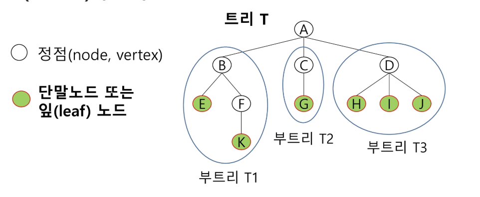

## 트리
### 트리의 개념
- 비선형 구조
- 원소들 간에 1:n 관계를 가지는 자료구조
- 원소들 간에 계층관계를 가지는 계층형 자료구조
- 상위 원소에서 하위 원소로 내려가면서 확장되는 트리(나무)모양의 구조

### 트리 - 정의
- 한 개 이상의 노드로 이루어진 유한 집합이며 다음 조건을 만족함
    - 노드 중 최상위 노드를 루트(root)라 함
    - 나머지 노드들은 n(>= 0)개의 분리 집합 T1, ... , TN으로 분리될 수 있음
- 이들 T1, ... , TN은 각각 하나의 트리가 되며(재귀적 정의) 루트의 부 트리(subtree)라 함
{width=300 height=200}

