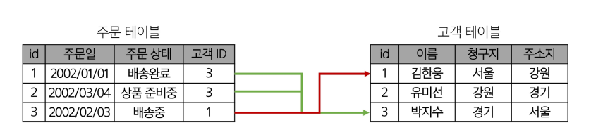
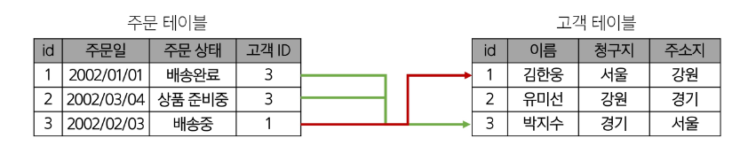
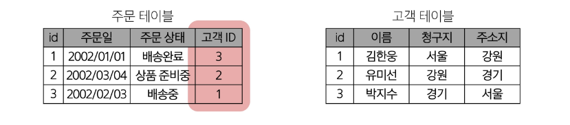

## 데이터베이스 역할
- 데이터를 저장하고 조작

### 관계형 데이터베이스
- 데이터 간에 관계가 있는 데이터 항목들의 모음
- 테이블, 행, 열의 정보를 구조화하는 방식
- 서로 관련된 데이터 포인터를 저장하고 이에 대한 액세스를 제공

### 관계
- 여러 테이블 간의(논리적) 연결

#### 관계로 할 수 있는 것
- 이 관계로 인해 두 테이블을 사용하여 데이터를 다양한 형식으로 조회할 수 있음
    - 특정 날짜에 구매한 모든 고객 조회
    - 지난 달에 배송일이 지연된 고객 조회 등

#### 관계형 데이터베이스 예시
##### 1)
- 다음과 같이 고객 데이터가 테이블에 저장되어 있다고 가정
- 고객 데이터 간 비교를 위해서는 어떤 값을 활용해야 할까?
    - 각 데이터에 고유한 식별 값을 부여하기(기본 키, Primary Key)

##### 2)
- 누가 어떤 주문을 했는지 어떻게 식별할 수 있을까?
    - 주문 정보에 고객의 고유한 식별 값을 저장하기(외래키, Foreign Key)

### 관계형 데이터베이스 관련 키워드
- Table(= Relation)
    - 데이터를 기록하는 곳

- Field(= Column, Attribute)
    - 각 필드에는 고유한 데이터 형식(타입)이 지정됨

- Record(= Row, Tuple)
    - 각 레코드에는 구체적인 데이터 값이 저장됨

- Database(= Schema)
    - 테이블의 집합

- Primary Key(기본 키, PK)
    - 각 레코드의 고유한 값
    - 관계형 데이터베이스에서 레코드의 식별자로 활용

- Foreign Key(외래 키, FK)
    - 테이블의 필드 중 다른 테이블의 레코드를 식별할 수 있는 키
    - 다른 테이블의 기본 키를 참조
    - 각 레코드에서 서로 다른 테이블 간의 관계를 만드는 데 사용

## RDBMS
### DBMS(Database Management System)
- 데이터베이스를 관리하는 소프트웨어 프로그램
- 데이터 저장 및 관리를 용이하게 하는 시스템
- 데이터베이스와 사용자 간의 인터페이스 역할
- 사용자가 데이터 구성, 업데이트, 모니터링, 백업, 복구 등을 할 수 있도록 도움

###

