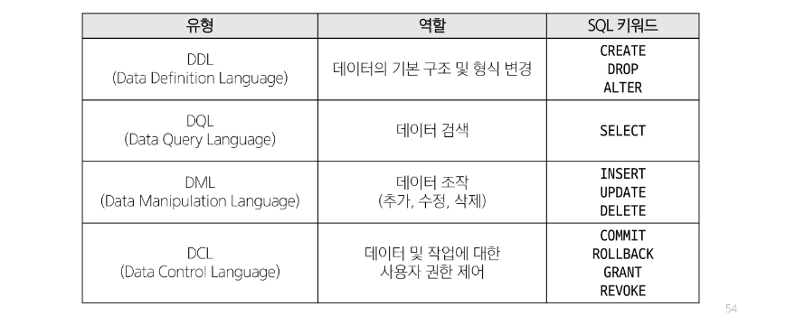

## SQL(Structure Query Language)
- 데이터베이스에 정보를 저장하고 처리하기 위한 프로그래밍 언어
- 테이블의 형태로 구조화된 관계형 데이터베이스에게 요청을 질의(요청)
- 관계형 데이터베이스와의 대화를 위해 사용하는 프로그래밍 언어

### SQL Syntax
~~~SQL
SELECT column_name FROM table_name;
~~~
1. SQL 키워드는 대소문자를 구분하지 않음
    - 하지만 대문자로 작성하는 것을 권장(명시적 구분)

2. 각 SQL Statements의 끝에는 세미콜론(';')이 필요
    - 세미콜론은 각 SQL Statements을 구분하는 방법(명령어의 마침표)

## SQL Statements
- SQL을 구성하는 가장 기본적인 코드 블록

### SQL Statements 예시
~~~
SELECT column_name FROM table_name;
~~~
- 해당 예시 코드는 SELECT Stataments라 부름
- 이 Statement는 SELECT, FROM 2개의 keyword로 구성됨

### 수행 목적에 따른 SQL Statements 4가지 유형
1. DDL - 데이터 정의
2. DQL - 데이터 검색
3. DML - 데이터 조작
4. DCL - 데이터 제어

