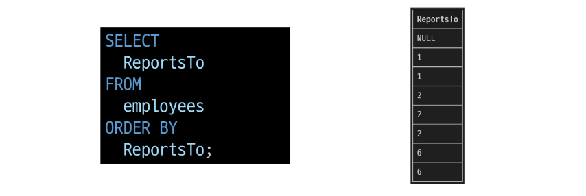

## ORDER BY
### ORDER BY statement
- 조회 결과의 레코드를 정렬

### ORDER BY syntax
~~~SQL
SELECT 
    select_list
FROM
    table_name
ORDER BY
    column1 [ASC|DESC],
    column2 [ASC|DESC],
    ...;
~~~
- FROM clause 뒤에 위치
- 하나 이상의 컬럼을 기준으로 결과를 오름차순(ASC, 기본 값), 내림차순(DESC)으로 정렬

#### ORDER BY 활용 1
- 테이블 employees에서 FirstName 필드의 모든 데이터를 오름차순으로 조회
~~~SQL
SELECT FirstName
FROM employees
ORDER BY FirstName;
~~~

#### ORDER BY 활용 2
- 테이블 employees에서 FirstName 필드의 모든 데이터를 내림차순으로 조회
~~~SQL
SELECT FirstName
FROM employees
ORDER BY FirstName DESC;
~~~

#### ORDER BY 활용 3
- 테이블 customers에서 Country 필드를 기준으로 내림차순 정렬한 다음 City 필드 기준으로 오름차순 정렬하여 조회
~~~SQL
SELECT Country, City
FROM customers
ORDER BY Country DESC, City;
~~~

#### ORDEY BY 활용 4
- 테이블 tracks에서 Milliseconds 필드를 기준으로 내림차순 정렬한 다음 Name, Milliseconds 필드의 모든 데이터를 조회(단, Milliseconds 필드는 60,000으로 나눠 분 단위 값으로 출력)
~~~SQL
SELECT Name, Milliseconds / 60000 AS '재생 시간(분)'
FROM tracks
ORDER BY Milliseconds DESC;
~~~

### 정렬에서의 NULL
- NULL 값이 존재할 경우 오름차순 정렬 시 결과에 NULL이 먼저 출력

### SELECT statement 실행 순서

테이블에서(FROM) -> 조회하여(SELECT) -> 정렬(ORDER BY)
