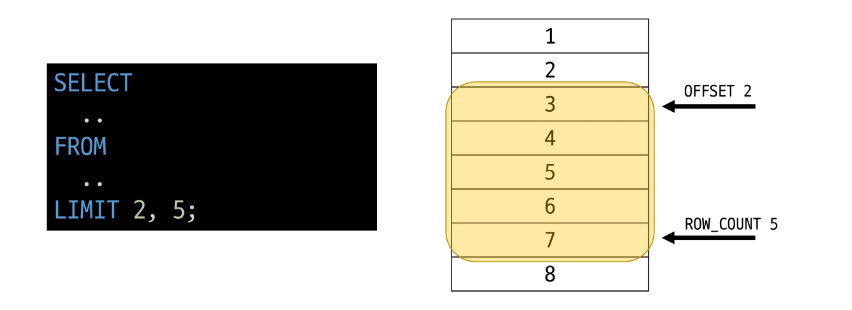

### Filtering data 관련 Keywords
- Clause
    - DISTINCT
    - WHERE
    - LIMIT

- Operator
    - BETWEEN
    - IN
    - LIKE
    - Comparison
    - Logical

## DISTINCT
### DISTINCT statement
- 조회 결과에서 중복된 레코드를 제거

### DISTINCT syntax
~~~SQL
SELECT DISTINCT select_list
FROM table_name;
~~~
- SELECT 키워드 바로 뒤에 작성해야 함
- SELECT DISTINCT 키워드 다음에 고유한 값을 선택하려는 하나 이상의 필드를 지정

#### DISTINCT 활용 1
- 테이블 customers에서 Country 필드의 모든 데이터를 오름차순 조회
~~~SQL
SELECT Country
FROM customers
ORDER BY Country;
~~~

#### DISTINCT 활용 2
- 테이블 customers에서 Country 필드의 모든 데이터를 중복없이 오름차순 조회
~~~SQL
SELECT DISTINCT Country
From customers
ORDER BY Country;
~~~

## WHERE
### WHERE statement
- 조회 시 특정 검색 조건을 지정

### WHERE syntax
~~~SQL
SELECT select_list
FROM table_name
WHERE search_condition;
~~~
- FROM clause 뒤에 위치
- search_condition은 비교연산자 및 논리연산자(AND, OR, NOT 등)를 사용하는 구문이 사용됨

#### WHERE 활용 1
- 테이블 customers에서 City 필드 값이 'Prague'인 데이터의 LastName, FirstName, City 조회
~~~SQL
SELECT LastName, FirstName, City
FROM customers
WHERE City = 'Prague';
~~~

#### WHERE 활용 2
- 테이블 customers에서 City 필드 값이 'Prague'가 아닌 데이터의 LastName, FirstName, City 조회
~~~SQL
SELECT LastName, FirstName, City
FROM customers
WHERE City != 'Prague';
~~~

#### WHERE 활용 3
- 테이블 customers에서 Company 필드 값이 NULL이고 Country 필드 값이 'USA'인 데이터의 LastName, FirstName, Company, Country 조회
~~~SQL
SELECT LastName, FirstName, Company, Country
FROM customers
WHERE Company IS NULL AND Country = 'USA';
~~~

#### WHERE 활용 4
- 테이블 customers에서 Company 필드 값이 NULL이거나 Country 필드값이 'USA'인 데이터의 LastName, FirstName, Company, Country 조회
~~~SQL
SELECT LastName, FirstName, Company, Country
FROM customers
WHERE Company IS NULL OR Country = 'USA';
~~~

#### WHERE 활용 5
- 테이블 tracks에서 Bytes 필드 값이 10,000 이상 500,000 이하인 데이터의 Names, Bytes 조회
~~~SQL
SELECT Names, Bytes
FROM tracks
WHERE Bytes BETWEEN 10000 AND BYTES 500000;
-- WHERE
--  Bytes >= 10000
--  AND Bytes <= 500000;
~~~

#### WHERE 활용 6
- 테이블 tracks에서 Bytes 필드 값이 10,000 이상 500,000 이하인 데이터의 Name, Bytes를 Bytes 기준으로 오름차순 조회
~~~SQL
SELECT Name, Bytes
FROM tracks
WHERE Bytes BETWEEN 10000 AND 500000
ORDER BY Bytes;
~~~

#### WHERE 활용 7
- 테이블 customers에서 Country 필드 값이 'Canada' 또는 'Germany' 또는 'France'인 데이터의 LastName, FirstName, Country 조회
~~~SQL
SELECT LastName, FirstName, Country
FROM customers
WHERE Country IN ('Canada', 'Germany', 'France');

-- WHERE
--  Country = 'Canada'
--  OR Country = 'Germany'
--  OR Country = 'France';
~~~

#### WHERE 활용 8
- 테이블 customers에서 Country 필드 값이 'Canada' 또는 'Germany' 또는 'France'가 아닌 데이터의 LastName, FirstName, Country 조회
~~~SQL
SELECT LastName, FirstName, Country
FROM customers
WHERE Country NOT IN ('Canada', 'Germany', 'France');
~~~

#### WHERE 활용 9
- 테이블 customers에서 LastName 필드 값이 'son'으로 끝나는 데이터의 LastName, FirstName 조회
~~~SQL
SELECT LastName, FirstName
FROM customers
WHERE LastName LIKE '%son';
~~~

#### WHERE 활용 10
- 테이블 customers에서 FirstName 필드 값이 4자리면서 'a'로 끝나는 데이터의 LastName, FirstName 조회
~~~SQL
SELECT LastName, FirstName
FROM customers
WHERE FirstName LIKE '___a';
~~~

## Operators
### Comparison Operators(비교 연산자)
=, >=, <=, !=, IS, LIKE, IN, BETWEEN...AND

### Logical Operators(논리 연산자)
AND(&&), OR(||), NOT(!)

### IN Operator
- 값이 특정 목록 안에 있는지 확인

### LIKE Operator
- 값이 특정 패턴에 일치하는지 확인(Wildcards와 함께 사용)

#### Wildcard Characters
- '%'
    - 0개 이상의 문자열과 일치 하는지 확인

- '_'
    - 단일 문자와 일치하는지 확인

## LIMIT
### LIMIT clause
- 조회하는 레코드 수를 제한

### LIMIT syntax
~~~SQL
SELECT select_list
FROM table_name
LIMIT [offset,] row_count;
~~~
- 하나 또는 두 개의 인자를 사용(0 또는 양의 정수)
- row_count는 조회하는 최대 레코드 수를 지정

#### LIMIT 활용 1
- 테이블 tracks에서 TrackId, Name, Bytes 필드 데이터를 Bytes 기준 내림차순으로 7개만 조회
~~~SQL
SELECT TrackId, Name, Bytes
FROM tracks
ORDER BY Bytes DESC
LIMIT 7;
~~~

#### LIMIT 활용 2
- 테이블 tracks에서 TrackId, Name, Bytes 필드 데이터를 Bytes 기준 내림차순으로 4번째부터 7번째 데이터만 조회
~~~SQL
SELECT TrackId, Name, Bytes
FROM tracks
ORDER BY Bytes DESC
LIMIT 3, 4;
-- LIMIT 4 OFFSET 3;
~~~