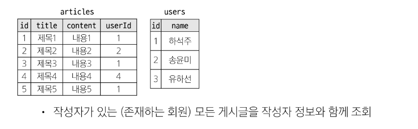

## Join
### 관계
- 여러 테이블 간의(논리적) 연결

### JOIN이 필요한 순간
- 테이블을 분리하면 데이터 관리는 용이해질 수 있으나 출력시에는 문제가 있음
- 테이블 한 개 만을 출력할 수 밖에 없어 다른 테이블과 결합하여 출력하는 것이 필요해짐
- 이때 사용하는 것이 'JOIN'

## Joining tables
## JOIN
### JOIN clause
- 둘 이상의 테이블에서 데이터를 검색하는 방법

### JOIN 종류
- INNER JOIN
- LEFT JOIN

## INNER JOIN
### INNER JOIN clause
- 두 테이블에서 값이 일치하는 레코드에 대해서만 결과를 반환

### INNER JOIN syntax
~~~SQL
SELECT select_list
FROM table_a
INNER JOIN table_b
    ON table_b.fk = table_a.pk;
~~~
- FROM 절 이후 메인 테이블 지정(table_a)
- INNER JOIN 절 이후 메인 테이블과 조인할 테이블을 지정(table_b)
- ON 키워드 이후 조인 조건을 작성
- 조인 조건은 table_a와 table_b 간의 레코드를 일치시키는 규칙을 지정

#### INNER JOIN 예시 1

~~~SQL
SELECT *
FROM articles
INNER JOIN users
ON users.id = articles.userId;
~~~

#### INNER JOIN 활용 1
- 1번 회원(하석주)가 작성한 모든 게시글의 제목과 작성자명을 조회
~~~SQL
SELECT articles.title, users.name
FROM articles
INNER JOIN users
ON users.id = articles.userId
WHERE users.id = 1;
~~~

## LEFT JOIN
### LEFT JOIN clause
- 오른쪽 테이블의 일치하는 레코드와 함께 왼쪽 테이블의 모든 레코드 반환

### LEFT JOIN syntax
~~~SQL
SELECT select_list
FROM table_a
LEFT JOIN table_b
    ON table_b.fk = table_a.pk;
~~~
- FROM 절 이후 왼쪽 테이블 지정(table_a)
- LEFT JOIN 절 이후 오른쪽 테이블 지정(table_b)
- ON 키워드 이후 조인 조건을 작성
  - 왼쪽 테이블의 각 레코드를 오른쪽 테이블의 모든 레코드와 일치시킴

#### LEFT JOIN 예시

~~~SQL
SELECT *
FROM articles
LEFT JOIN users
ON users.id = articles.userId;
~~~

### LEFT JOIN 특징
- 왼쪽 테이블의 모든 레코드를 표기
- 오른쪽 테이블과 매칭되는 레코드가 없으면 NULL을 표시

#### LEFT JOIN 활용 1
- 게시글을 작성한 이력이 없는 회원 정보 조회
~~~SQL
SELECT articles.name
FROM users
LEFT JOIN articles
ON articles.userId = users.id
WHERE articles.userId IS NULL;
~~~