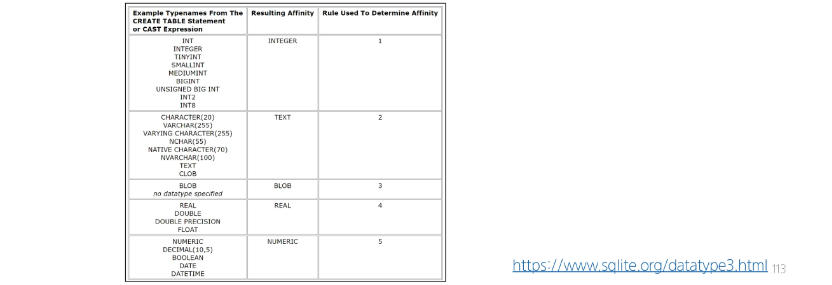

## 타입 선호도(Type Affinity)
- 컬럼에 데이터 타입이 명시적으로 지정되지 않았거나 지원하지 않을 때 SQLite가 자동으로 데이터 타입을 추론하는 것

### SQLite 타입 선호도의 목적
1. 유연한 데이터 타입 지원
   - 데이터 타입을 명시적으로 지정하지 않고도 데이터를 저장하고 조회할 수 있음
   - 컬럼에 저장되는 값의 특성을 기반으로 데이터 타입을 유추

2. 간편한 데이터 처리
   - INTEGER Type Affinity를 가진 열에 문자열 데이터를 저장해도 SQLite는 자동으로 숫자로 변환하여 처리

3. SQL 호환성
   - 다른 데이터베이스 시스템과 호환성을 유지

## NOT NULL
### 반드시 NOT NULL 제약을 사용해야 할까?
- "NO"
- 하지만 데이터베이스를 사용하는 프로그램에 따라 NULL을 저장할 필요가 없는 경우가 많으므로 대부분 NOT NULL을 정의
- "값이 없다." 라는 표현을 테이블에 기록하는 것은 "0"이나 "빈 문자열"등을 사용하는 것을 대체하는 것을 권장

## 날짜와 시간
### SQLite의 날짜와 시간
- SQLite에는 날짜 또는 시간을 저장하기 위한 별도 데이터 타입이 없음
- 대신 날짜 및 시간에 대한 함수를 사용해 표기 형식에 따라 TEXT, REAL, INTEGER값으로 저장