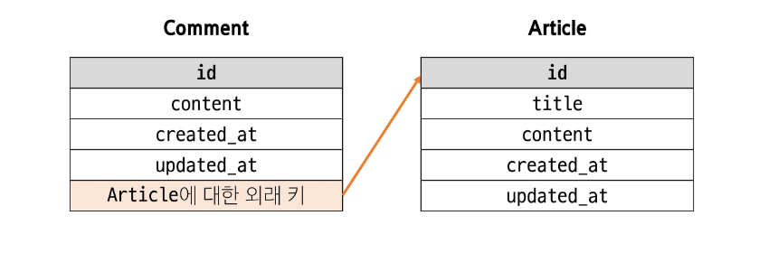
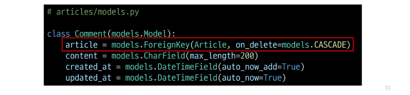

## 모델 관계
### Many to one relationships(N:1 or 1:N)
- 한 테이블의 0개 이상의 레코드가 다른 테이블의 레코드 한 개와 관련된 관계

#### Comment(N) - Article(1)
- 0개 이상의 댓글은 1개의 게시글에 작성될 수 있다

### 테이블 관계

## 댓글 모델 정의
### ForeignKey()
- 한 모델이 다른 모델을 참조하는 관계를 설정하는 필드
- N:1 관계 표현
- 데이터베이스에서 외래 키로 구현

### 댓글 모델 정의
- ForeignKey 클래스의 인스턴스 이름은 참조하는 모델 클래스 이름의 단수형으로 작성하는 것을 권장
- 외래 키는 ForeignKey 클래스를 작성하는 위치와 관계없이 테이블의 마지막 필드로 생성됨

### ForeignKey(to, on_delete)
- to
  - 참조하는 모델 class 이름
- on_delete
  - 외래 키가 참조하는 객체(1)가 사라졌을 때, 외래 키를 가진 객체(N)를 어떻게 처리할 지를 정의하는 설정(데이터 무결성)

### on_delete의 'CASCADE'
- 참조된 객체(부모 객체)가 삭제 될 때 이를 참조하는 모든 객체도 삭제되도록 지정

