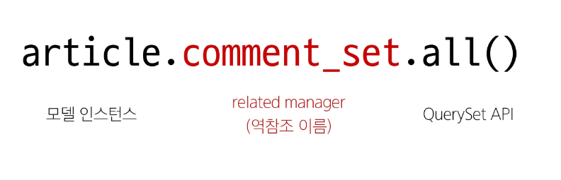

## 역참조
- N:1 관계에서 1에서 N을 참조하거나 조회하는 것 (1 -> N)
- 모델 간의 관계에서 관계를 정의한 모델이 아닌, 관계의 대상이 되는 모델에서 연결된 객체들에 접근하는 방식
- N은 외래 키를 가지고 있어 물리적으로 참조가 가능하지만, 1은 N에 대한 참조 방법이 존재하지 않아 별도의 역참조 키워드가 필요

### 역참조 사용 예시
~~~SQL
article.comment_set.all()
~~~

- 특정 게시글에 작성된 댓글 전체를 조회하는 요청

### related manager
- N:1 혹은 M:N관계에서 역참조 시에 사용하는 매니저
- 'objects' 매니저를 통해 QuerySet API를 사용했던 것처럼 related manager를 통해 QuerySet API를 사용할 수 있게 됨

### related manager 이름 규칙
- N:1 관계에서 생성되는 Related manager의 이름은 "모델명_set" 형태로 자동 생성됨
  - 관계를 직접 정의하지 않은 모델에서 연결된 객체들을 조회할 수 있게 함
- 특정 댓글의 게시글 참조(Comment -> Article)
  - comment.article
- 특정 게시글의 댓글 목록 참조(Article -> Comment)
  - article.comment_set.all()

### save(commit=False)
- DB에 저장 요청을 보내지 않고 인스턴스만 반환