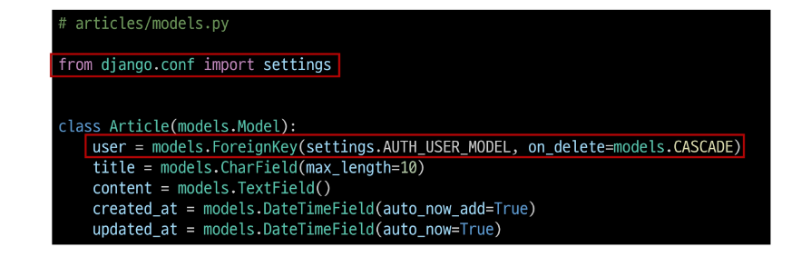
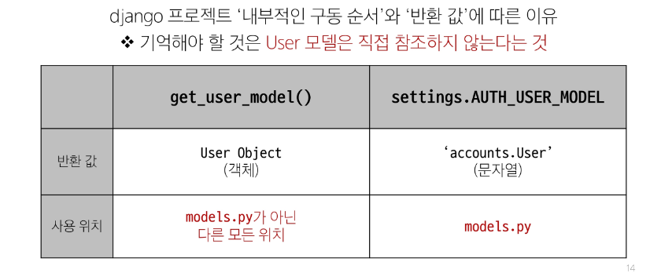
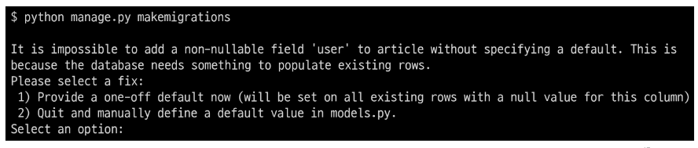
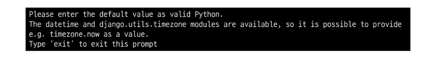

## 모델 관계 설정
### Article - User 모델 관계 설정
- User 외래 키 정의

### User 모델을 참조하는 2가지 방법
1. get_user_model()
2. settings.AUTH_USER_MODEL

### Migration
- 기존에 테이블이 있는 상황에서 필드를 추가 하려하기 때문에 발생하는 과정
- 기본적으로 모든 필드에는 NOT NULL 제약조건이 있기 때문에 데이터가 없이는 새로운 필드가 추가되지 못함
- '1'을 입력하고 Enter 진행(다음 화면에서 직접 기본 값 입력)

- 추가하는 외래 키 필드에 어떤 데이터를 넣을 것인지 직접 입력해야 함
- 마찬가지로 '1'을 입력하고 Enter 진행
- 기존에 작성된 게시글이 있다면 모두 1번 회원이 작성한 것으로 처리됨

- migrations 파일 생성 후 migrate 진행 

## 게시글 CREATE

## 게시글 READ