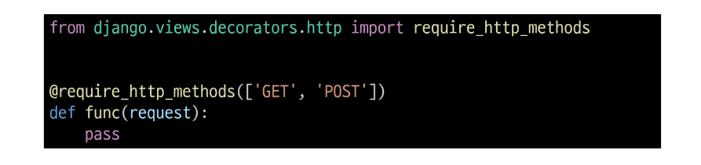
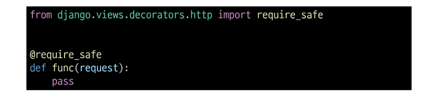
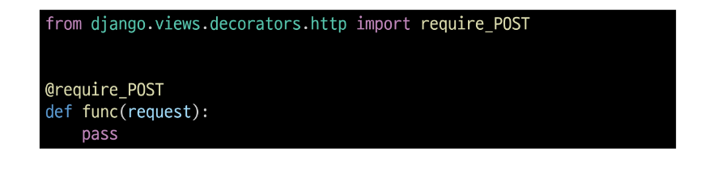

## View decorators
- View 함수의 동작을 수정하거나 추가 기능을 제공하는 데 사용되는 Python 데코레이터
- 코드의 재사용성을 높이고 뷰 로직을 간결하게 유지

### View decorators 종류
- Allowed HTTP methods
- Conditional view processing
- GZip compression
...

## Allowed HTTP methods
- 특정 HTTP method로만 View 함수에 접근할 수 있도록 제한하는 데코레이터

### 주요 Allowed HTTP methods
1. require_http_methods(["METHOD1", "METHOD2", ...])
   - 지정된 HTTP method만 허용

2. require_safe()
   - GET과 HEAD method만 허용

3. require_POST()
   - POST method만 허용

### require_http_methods()
- 지정된 HTTP method만 허용

### require_safe()
- GET과 HEAD method만 허용

### require_POST()
- POST method만 허용

### Allowed HTTP methods 주요 특징
- 지정되지 않은 HTTP method로 요청이 들어오면 HttpResponseNotAllowed(405)를 반환
- 대문자로 HTTP method를 지정

### require_GET 대신 require_safe를 권장하는 주요 이유
- 웹 표준 준수
  - GET과 HEAD는 "안전한(safe)" 메소드로 간주됨
- 호환성
  - 일부 소프트웨어는 HEAD 요청에 의존
- 웹 표준을 준수하고, 더 넓은 범위의 클라이언트와 호환되며, 안전한 HTTP 메소드만을 허용하는 view 함수를 구현할 수 있음

