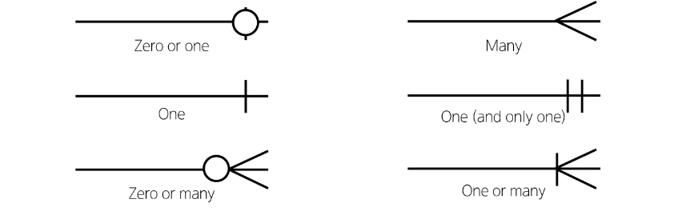

## ERD
- "Entity-Relationship Diagram"
- 데이터베이스의 구조를 시각적으로 표현하는 도구
- Entity(객체), 속성, 그리고 엔티티 간의 관계를 그래픽 형태로 나타내어 시스템의 논리적 구조를 모델링하는 다이어그램

## ERD 구성 요소
1. 엔티티(Entity)
   - 데이터베이스에 저장되는  개체체나 개념
   - ex) 고객, 주문, 제품
2. 속성(Attribute)
   - 엔티티의 특성이나 성질
   - ex) 고객(이름, 주소, 번화번호)
3. 관계(Relationship)
   - 엔티티 간의 연관성
   - ex) 고객이 '주문'한 제품

### 개체와 속성
- 개체: 회원(User)
- 속성: 회원번호(id), 이름(name), 주소(address) 등
  - 개체가 지닌 속성 및 속성의 데이터 타입

### 관계
- 관계: 회원과 댓글 간의 관계
  - 회원이 "작성"한 댓글

### Cardinality
- 한 엔티티와 다른 엔티티 간의 수적 관계를 나타내는 표현
- 주요 유형
  - 일대일 (one-to-one, 1:1)
  - 다대일 (many-to-one, N:1)
  - 다대다 (many-to-many, M:N)

### Cardinality 표현
- 선의 끝부분에 표시되며 일반적으로 숫자나 기호(까마귀 발)로 표현됨

### Cardinality 적용
- 회원은 여러 댓글을 작성한다.
- 각 댓글은 하나의 회원만 존재한다.

### ERD의 중요성
- 데이터베이스 설계의 핵심 도구
- 시각적 모델링으로 효과적인 의사소통 지원
- 실제 시스템 개발 전 데이터 구조 최적화에 중요

## ERD 제작 사이트
