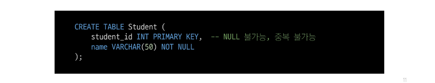
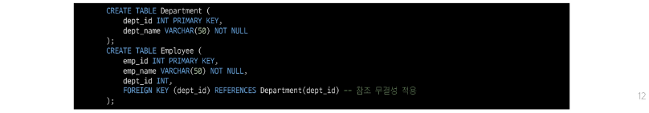
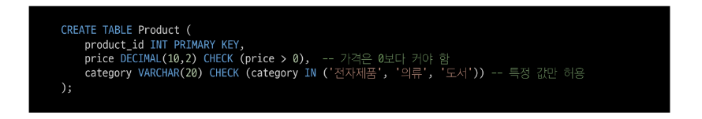
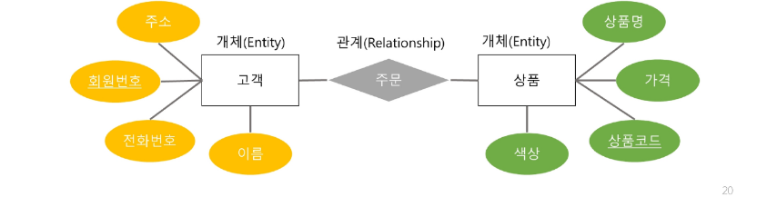
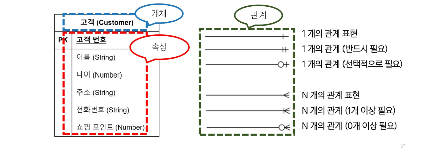
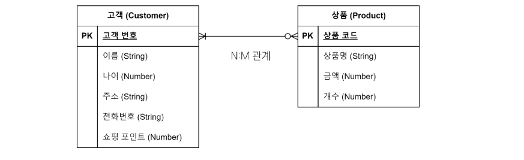
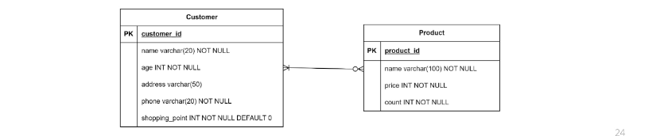

## 데이터베이스 모델링
- 데이터베이스 시스템을 구축하기 위해, 데이터의 구조와 관계, 제약 조건 등을 설계하여 효율적이고 일관성 있는 데이터베이스를 만들기 위한 과정
- 모델링을 통해 성능, 무결성, 신뢰성을 보장할 수 있음

### 데이터베이스의 중요성
- 효율성
  - 데이터베이스 구조를 잘 설계하면 쿼리 성능과 저장 효율이 향상
- 일관성
  - 중복과 이상 현상을 최소화하여, 데이터가 서로 모순되거나 충돌하지 않도록 함
- 무결성 보장
  - 무결성 제약 조건을 모델링 단계에서 설정해두어, 부적잘한 데이터를 방지

## 무결성 제약 조건
### 무결성
- 데이터베이스가 잘못된 데이터의 삽입, 수정, 삭제로부터 보호되어, 데이터의 일관성과 신뢰성을 유지하는 것

#### 대표적인 무결성 제약 조건
1. 개체 무결성
2. 참조 무결성
3. 도메인 무결성

### 개체 무결성(Entity Integrity)
- 기본 키(Primary Key)가 유일(중복 불가)하고 'NULL'값을 허용하지 않는 제약
- 핵심 원칙
  - 각 레코드는 유일한 식별자를 가져야 함(PK 중복 불가)
  - 기본 키는 NULL 값을 가질 수 없음(필수 값)

### 참조 무결성(Referential Integrity)
- 외래 키와 관련된 제약으로, 존재하지 않는 기본 키를 참조하지 못하도록 하는 규칙
- 핵심 원칙
  - 외래 키는 참조 대상 테이블의 기본 키 값을 참조하거나 'NULL'을 가질 수 있음
  - 참조 대상 테이블에 존재하지 않는 기본 키 값은 사용할 수 없음
  - 외래 키로 연결된 레코드를 삭제, 수정할 때, 연쇄 작업(ON DELETE CASCADE 등) 또는 예외 처리를 통해 무결성 유지

### 도메인 무결성(Domain Integrity)
- 각 속성(컬럼)이 정의된 도메인(값의 범위, 형식)을 벗어나지 않도록 하는 제약
- 핵심 원칙
  - 속성별로 데이터 타입, 길이, 범위 등을 정의해야 함
  - 값이 해당 범위(도메인)를 벗어나면 삽입, 수정이 제한되거나 오류 발생

### 그 외 무결성 제약 조건
1. 고유성(UNIQUE)
   - 특정 컬럼의 값이 테이블 내에서 중복되지 않도록 제한
   - 예: 이메일 주소는 한 사용자가 하나만 등록 가능
2. NULL 무결성 (NOT NULL)
   - 특정 컬럼이 NULL 값을 가질 수 없도록 하는 제약
3. 일반 무결성(General Integrity)
   - 위의 특정 제약조건 외에도, 비즈니스 로직에 따라 추가로 정의하는 무결성 규칙
   - 예: 은행 잔고가 0 미만이 되지 않도록 하거나, 재고 수량이 음수가 되지 않도록 하는 규칙

## 모델링 과정 4단계
### 데이터베이스 모델링 진행
요구사항 수집 및 분석 -> 개념적 설계 -> 논리적 설계 -> 물리적 설계

### 요구사항 수집 및 분석
- 어떤 종류의 데이터를 정리하는지 정보 수집하고 어떤 작업을 수행해야 하는지 파악하는 단계
  - 개체(Entity)
    - 업무에 필요하고 유용한 정보를 저장하는 집합적인 것
    - 예: 고객, 상품품
  - 속성(Attribute)
    - 관리하고자 하는 것의 의미를 더 이상 작은 단위로 분리되지 않은 데이터 단위
    - 예: 고객명, 고객 전화번호, 상품명, 상품 가격
  - 관계(Relationship)
    - 객체 사이의 논리적인 연관성을 의미하는 것
    - 예: 고객은 다수의 상품을 주문, 상품은 다수의 고객들에게 판매될 수 있음

### 개념적 설계
- 요구사항을 기반으로 데이터베이스의 개념적 모델을 설계
- 개체(Entity)와 관계(Relationship)를 식별하고, 개체 간의 관계를 정의하여 ER Diagram을 작성

### ERD 표기 방법
- 까마귀 발 모델(Corw's Foot Model) 표기법

- N:M 관계 예시

### 논리적 설계
- 개념적 설계를 기반으로 데이터베이스의 논리적 구조를 설계
- 테이블, 칼럼(속성), 제약 조건 등과 같은 구체적인 데이터베이스 개체를 정의
- 정규화를 수행하여 데이터의 중복을 최소화하고 일관성을 유지          

### 물리적 설계
- 논리적 설계를 기반으로 데이터베이스를 실제 저장 및 운영 할 수 있는 형태로 변환하는 단계
- 테이블의 인덱스, 파티션, 클러스터링 등 물리적인 구조와 접근 방식을 결정
- 보안, 백업 및 복구, 성능 최적화 등을 고려하여 데이터베이스를 설정