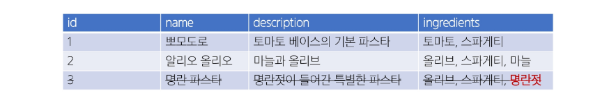
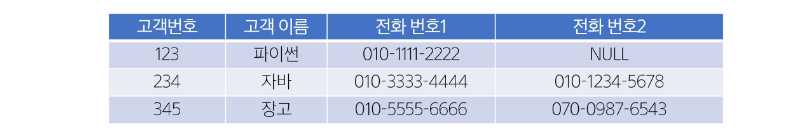
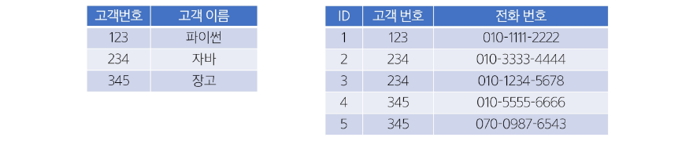
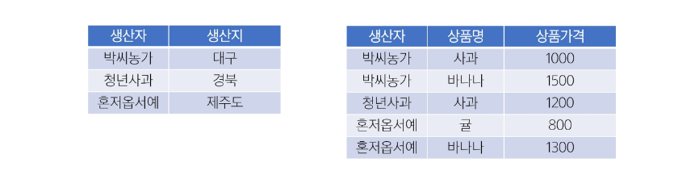
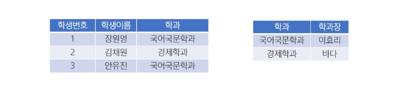
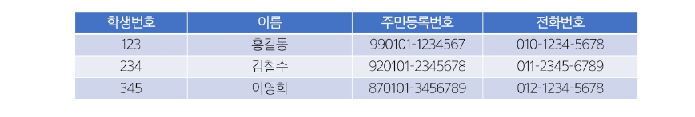
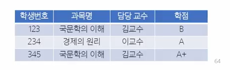
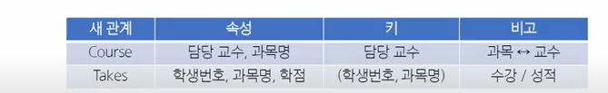
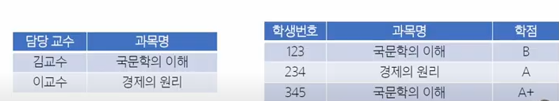

## 정규화(Normalization)
- 데이터 중복을 최소화하고, 이상 현상을 예방하며, 데이터베이스 구조 변경 시 재작업을 줄이는 목적으로 테이블을 구조화하는 과정

### 정규화 목적
1. 중복 최소화
   - 불필요한 중복 데이터를 제거해 일관성 유지
2. 이상 현상 방지
   - 삽입, 갱신, 삭제 작업 시 발생할 수 있는 불일치 문제 예방
3. 유연성 향상
   - 데이터베이스 구조 변경 시 영향을 받는 영역을 최소화하여 유지보수성을 높임

## 이상 현상(Anomaly)
- 데이터베이스를 비정상적으로 설계 했을 때 중복된 데이터가 많아져 삽입, 갱신, 삭제 등의 연산에서 비일관성이 생기는 문제

### 이상 현상 종류
1. 삽입 이상(Insertion Anomaly)
   - 새로운 데이터를 삽입하기 위해 불필요한 데이터도 함께 삽입해야 하는 문제
2. 갱신 이상(Update Anomaly) 
    - 중복된 데이터 중 일부만 변경되어 데이터 불일치가 발생하는 문제
3. 삭제 이상(Deletion Anomaly)
    - 어떤 데이터를 삭제할 때, 반드시 있어야 하는 정보까지 같이 사라지는 문제

### 삽입 이상
- Recipe table에 삽입된 데이터 정보가 아래와 같을 때
- "마늘" 식재료가 추가 되어야 한다면, 마늘 정보를 어디에 삽입 해야 하는가?
- "마늘" 재료만 미리 등록ㅎ하고 싶어도, 요리 이름이 필요하다는 이유로 가짜 name과 description 등을 만들어야 함
- 새로운 재료 또는 부분적인 정보만을 삽입하기 위해 불필요한 레시피 정보까지 억지로 입력해야 하는 상황이 "삽입 이상"

### 갱신 이상
- "파스타"라는 재료명을 "스파게티"로 변경하고자 하는 상황
- 현재 테이블에서 재료가 문자열로 저장되고 있으므로, ingredients 컬럼 내 "파스타"라는 부분 문자열을 모두 찾아서 일괄 변경해야 함
- 여러 요리에 "토마토, 파스타", "파스타, 치즈, 면" 등으로 저장되어 있응ㄹ 수 있는데, 어떤 행은 업데이트가 누락되면, "파스타"와, "스파게티"가 혼재하는 불일치 상황 발생
- 중복된 데이터가 여러 행에 문자열 형태로 산재해 있어, 수정 시 모두 찾아서 변경해야 함
- 일부만 수정하면 불일치(데이터 모순)가 생기는 문제를 갱신 이상이라 함

### 삭제 이상
- "명란 파스타" 정보를 삭제하고자 함
- 이 레시피의 식재료 컬럼에는 올리브, 스파게티, 명란젓이 포함되어 있었음
- 만약 이 테이블에서만 "명란젓"이란 재료 정보를 유일하게 보관하고 있었다면, 해당 행 삭제와 함께 "명란젓" 재료 자체에 대한 정보도 소실되는 결과 초래
- 특정 레시피(행)를 지울 때, 그 행 안에 있는 재료에 대한 정보까지 같이 사라짐
- 실제로는 "재료 정보" 자체는 남겨두고 싶었지만, 테이블 구조상 둘이 붙어 있어서 불필요하게 삭제되는 것이 삭제 이상

### 문제 원인
- 하나의 테이블에 요리에 대한 설명, 식별자, 재료 정보 등이 중복된 구조로 뒤섞여 있음
- 재료와 레시피의 관계가 1:N or N:M일 수도 있음에도, 단일 필드(ingredients)로 모아둔 상태

### 해결 방법(정규화)
- 재료(Ingredient)를 별도 테이블로 분리
- 레시피(Recipe) 테이블 <-> 재료(Ingredient) 테이블 간 N:M(ManyToMany) 구조를 설정
  - 예: 중개 테이블 Recipe_Ingredient(recipe_id, ingredient_id)
- 그렇게 하면
  - 삽입 이상: "마늘"만 등록할 수 있음(Ingredient 테이블). 레시피 미정이어도 문제 없음
  - 갱신 이상: "파스타" -> "스파게티"를 Ingredient 테이블에서 한 번만 수정하면, 모든 레시피에 반영
  - 삭제 이상: 레시피 삭제 시 ingredient 테이블의 "명란젓"은 남아있을 수 있음(모두 연결 끊긴 경우에만 자동 삭제 여부를 결정할 수 있음)

## 정규화 종류
- 일반적으로 1NF(제1 정규형)에서 시작해, 2NF, 3NF 순으로 진행하며, 필요에 따라 BCNF 이상(4NF, 5NF, 6NF)까지 고려하기도 함
- 실무에서는 보통 3NF 또는 BCNF까지 도달하면 정규화가 이루어졌다고 표현

### 각 정규화 단계
- 제 1정규형(1NF)
  - 각 요소의 중복되는 항목이 없어야 한다.
- 제 2정규형(2NF)
  - 제 1정규형을 만족하면서 PK가 아닌 모든 속성이 PK에 완전 함수 종속되어야 한다.
- 제 3정규형(3NF)
  - 제 2정규형을 만족하면서 모든 속성이 PK에 이행적 함수 종속이 되지 않아야 한다.
- BCNF(Boyce Codd Normalization Form)
  - 제 3정규형을 만족하면서, 모든 결정자가 후보 키여야 한다.

## 1NF
1. 각 속성(컬럼)이 원자 값(Atomic Value), 즉 하나의 값만 가져야 함
2. 중복된 컬럼이 없어야 함
3. 각 행(row)이 유일하게 식별될 수 있어야 함(기본 키 존재)

### 제 1정규형 시도
- 2개를 초과하는 전화번호를 저장할 수 없음
- 해결을 위해 column을 추가하는 경우, 불필요한 NULL 값을 가지게 됨

- 동일 데이터를 여러 row로 나누어서 저장하는 경우, 기본 키가 중복 됨

### 제 1정규형 결과
- 고객 번호를 참조하여, 전화번호를 저장하는 테이블을 분리

## 2NF
1. 제 1정규형을 만족해야 함
2. 복합 키(두 개 이상의 컬럼으로 이루어진 기본 키)를 사용하는 테이블에서 모든 비 키본 키 속성이 기본 키의 모든 컬럼에 완전 종속되어야 함
   - 즉, 부분 함수 종속(기본 키 일부 컬럼만으로 해당 속성이 결정되는 것)을 제거

### 제 2정규형 진행
- 완전 함수적 종속
- 부분 함수적 종석

### 제 2정규형 결과
- "생산자"와 "생산지"가 완전 함수적 종속이 되도록 테이블 분리

## 3NF
1. 제 2정규형을 만족해야 함
2. 기본 키에 대한 이행적 함수 종속(Transitive Dependency)이 없어야 함
   - A -> B, B -> C 인 경우, A -> C를 "이행 종속"이라 부름
   - 기본 키가 아닌 속성이 다른 속성(역시 기본 키가 아닌)에 의해 결정되지 않아야 함

- 예: 학생 테이블에서 학과 번호 -> 학과 명 -> 대학 이름 식으로 이어진다면, "학과 번호 -> 대학 이름" 부분을 별도 테이블로 분리

### 제 3정규형 진행
- 기본 키(PK)가 아닌 속성 간이 종속성을 제거해야 함
- 비 기본 키 컬럼이 다른 비 기본 키 컬럼을 결정하면 안 됨
  - 학생번호 -> 학과, 학과 -> 학과장
  - 학생 번호는 학과장을 직접 결정하지 않음 -> 이행적 함수 종속 발생

### 제 3정규형 결과
- "학생정보"와 "학과정보"를 별도 테이블로 분리

## BCNF(Boyce Codd Normal Form)
1. 제 3정규형을 만족해야 함
2. 모든 결정자가 후보 키(Candidate Key)여야 함
3. 3NF 이후에도 남아있는 이상 현상을 해결하는 더 엄격한 형태
4. 기본 키가 아닌 속성이 다른 컬럼을 결정할 수 없게끔 테이블을 분해
- 결정자
  - 어떤 속성(또는 속성 집합)이 다른 속성을 결정(함수 종속)할 때, 그 결정자가 곧 후보 키가 되어야 한다는 규칙

### 후보 키(Candidate Key)
- 한 테이블의 각 행(row)을 유일하게 식별 할 수 있는 속성(또는 속성 조합) 중 최소성을 만족하는 키
- 후보 키의 조건
  - 유일성(Unique): 테이블의 각 행을 고유하게 식별 할 수 있어야 함
  - 최소성(Minimality): 불필요한 컬럼을 포함하지 않는, 최소한의 속성 조합이어야 함
- 한 테이블에 여러 후보 키가 있을 수 있으며, 그 중 하나를 Primary Key로 선택해야 함

### 후보 키 예시
- 학생번호: 각 학생을 유일하게 식별 가능 -> 후보 키
- 주민등록번호: 각 학생을 유일하게 식별 가능 -> 후보 키
- 전화번호: 일반적으로 유일할 가능성이 높지만, 변경될 수 있음 -> 후보 키 가능성 없음
- 이름: 동명이인이 존재할 수 있음 -> 후보 키 불가능

### BCNF 진행
- 각 교수는 정확히 한 과목만 담당한다고 가정
  - 담당 교수 -> 과목명
- 한 학생이 한 괌고에 대해 받을 학점은 하나뿐
  - (학생번호, 과목명) -> 학점

- 후보 키 찾기
  - {학생번호, 과목명}
    - 두 속성을 함께 알면 다른 모든 속성(담당 교수, 학점)을 유일하게 결정
    - 후보 키를 만족
  - 과목명만으로는 중복 학생이 있을 수 있고, 학생번호만으로는 여러 과목을 수강하므로 단독으로는 후보키가 아님

- BCNF 규칙: 모든 결정자(좌항)는 후보 키여야 함
1. (학생번호, 과목명) -> 학점
   - 결정자가 후보 키? YES
2. 담당 교수 -> 과목명
   - 결정자가 후보 키? NO(담당 교슈는 후보 키가 아님)
   - BCNF 위반

- 새로운 관계 설계
- 담당 교수 -> 과목명이 BCNF를 깨트리므로 이를 기준으로 분해

### BCNF 결과
- 정규화 후 예시 데이터

### 정규화 주의사항
- 3NF 이상으로 들어가면 BCNF, 4NF, 5NF, 6NF 등이 있으나, 지나친 분리로 인한 조인(Join) 증가나 성능 저하 등의 문제가 발생
- 따라서 업무 요구에 따라 필요한 만큼 정규화/반정규화를 조정할 것을 권장

### 정리
- 정규화는 중복 데이터와 이상 현상을 줄이기 위한 DB 설계 기법
- 일반적으로 1NF -> 2NF -> 3NF 순으로 진행
- 이상 현상(Anomaly)
  - 삽입/갱신/삭제 작업에서 생길 수 있는 문제점을 예방
- BCNF
  - 3NF보다 엄격한 규칙으로, 모든 결정자는 후보 키가 되어야함
- 정규화를 통해 데이터 무결성과 일관성을 확보하고, 유지보수 시 구조 변경 부담을 최소화할 수 있음
