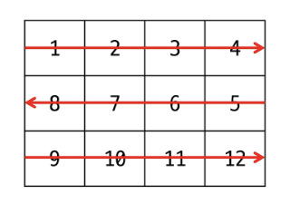
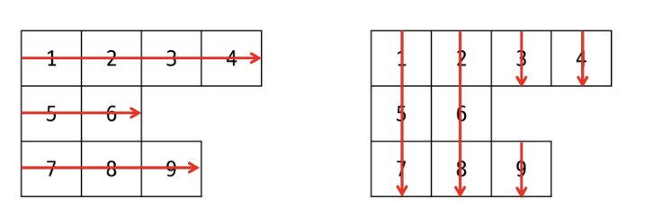
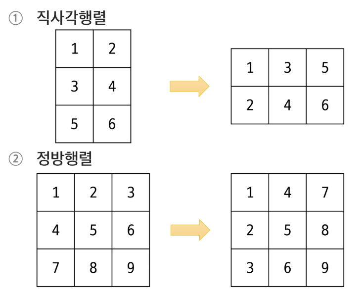

## 2차원 배열
- 배열의 각 요소가 또 다른 1차원 배열을 가리킴 (크기가 일정하지 않아도 OK)
- 행(row)과 열(column)의 구조 / 테이블 구조 / 좌표 평면 구조 등

### 2차원 배열의 선언
- 데이터타입[][] 배열이름
~~~Java
int[][] arr = new int[2][4];
~~~

### 2차원 배열 인덱스
- 인덱스를 이용하여 요소에 접근
- arr[행 인덱스][열 인덱스]
~~~Java
int[][] scores = {{90, 80, 85, 100}, {100, 80, 75, 60}, {50, 90, 100, 100}};
~~~

### 2차원 배열 순회
- N x M 크기의 배열의 모든 요소를 처음부터 끝까지 (또는 일부 구간) 확인하는 방법

### 행 우선 순회(Row-major traversal)
- 행을 고정 시킨 뒤 열을 순회하는 방법
~~~
int i;  // 행의 좌표
int j;  // 열의 좌표

for i from 0 to n-1
    for j from 0 to m-1
        Array[i][j]  // 필요한 연산 수행
~~~

### 열 우선 순회(Column-major traversal)
- 열을 고정 시킨 뒤 행을 순회하는 방법
~~~
int i;  // 행의 좌표
int j;  // 열의 좌표

for j from 0 to m-1
    for i from 0 to n-1
        Array[i][j]  // 필요한 연산 수행
~~~

### 지그재그 순회
- 짝수 행: 왼 -> 오
- 홀수 행: 왼 <- 오
~~~
int i;  // 행의 좌표
int j;  // 열의 좌표

for i from 0 to n-1
    for j from 0 to m-1
        Array[i][j+(m-1-2*j)*(i%2)]  // 필요한 연산 수행
~~~

### 가변 길이(Jagged) 2차원 배열 순회
- 1차원 배열의 길이가 다른 배열 순회

## 2차원 배열 응용
### 델타를 활용한 이동
- 2차원 배열에서 상하좌우 또는 대각선 등 여러 방향으로 위치를 옮길 때, 규칙적으로 변하는 변화량을 정의하여 활용하는 방식
~~~
array[0...n-1][0...n-1]  // 2차원 배열
dr[] <- {-1, 1, 0 ,0}  // 상하좌우
dc[] <- {0, 0, -1, 1}

for r in from - to n-1
    for c in from 0 to n-1
        for d from 0 to 3
            nr <- r + dr[d];
            nc <- c + dc[d];
            // 조건
            array[nr][nc];  // 필요한 연산 수행
~~~

### 전치 행령(Transposed Matrix)
- 행렬의 행과 열을 서로 바꾼 형태의 행렬

