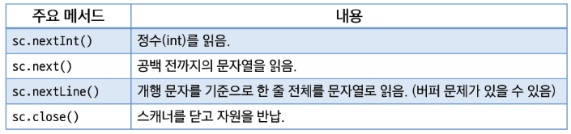
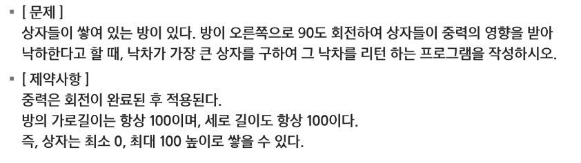
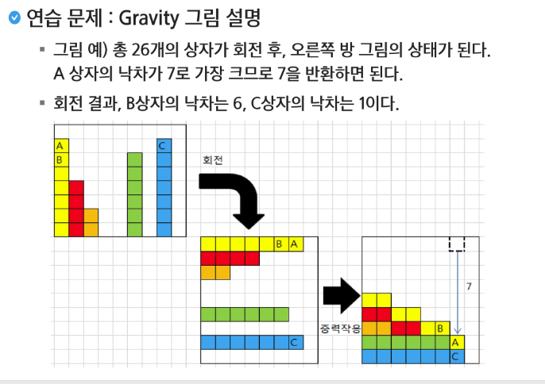
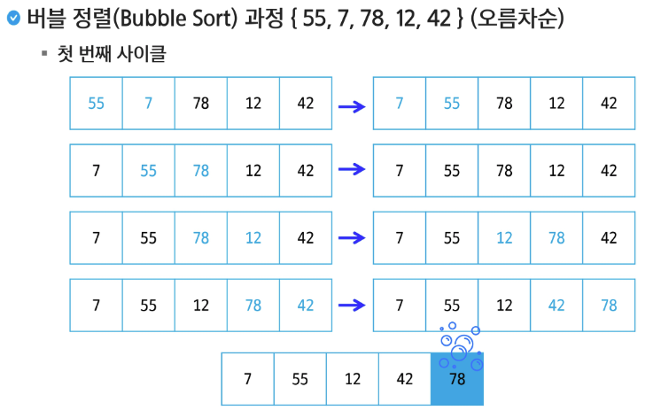

## 1차원 배열
### 배열(Array)
-  동일한 데이터 타입의 값들을 저장하기 위한 자료구조
~~~Java
int num = 0;
int num1 = 1;
int num2 = 2;
int num3 = 3;
int num4 = 4;
int num5 = 5;
~~~

~~~Java
int[] nums = {0, 1, 2, 3, 4, 5}
~~~

### 배열의 필요성
- 프로그램 내에서 여러 개의 변수가 필요할 때, 전부 다른 변수명을 이용하여 접근하는 것은 비효율적
- 배열을 사용하면 한 번의 선언을 통해서 여러 개의 데이터를 다룰 수 있음
- 단순히 여러 개의 변수를 편하게 사용하는 것이 아닌 다수의 변수로 하기 힘든 작업을 배열을 통해 쉽게 활용할 수 있음

### 1차원 배열의 선언 필요한 요소 3가지
1. 자료형: 배열을 이루는 자료형(기초자료형, 참조자료형 모두 가능)
2. 배열이름: 프로그램에서 사용할 배열의 이름(주소 값 저장)
3. 길이: 배열을 이루는 요소의 값(배열은 고정된 길이)
- 자료형[] 배열이름 = new 자료형[길이];

~~~Java
int[] nums = new int[6]
~~~

### 1차원 배열의 요소 접근
- 인덱스의 값은 0부터 시작
- 배열의 길이를 벗어나는 값을 사용할 수 없음(N개의 크기 -> 0 ~ N-1활용)
- nums[0] = 10; // 배열 nums의 0번째 원소에 10을 저잦ㅇ
- nums[idx] = 20; // 배열 nums의 idx번째 원소에 20을 저장 (idx=4)

### 1차원 배열의 순회
- 배열의 요소를 빠짐 없이 탐색하는 방법
~~~Java
for ( ;  ; ){

}
~~~

### Scanner
- 표준 입력(주로 콘솔)으로 부터 데이터를 쉽게 읽어오기 위해 사용되는 클래스
~~~ Java
import java.util.Scanner;
Scanner sc = new Scanner(System.in)
~~~

### 연습 문제: Gravity

## 버블 정렬
### 정렬(Sort)
- 데이터(숫자, 문자, 객체 등)들을 일정한 규칙(오름차순, 내림차순 등)에 따라 순서대로 재배열 하는 것
- 다양한 알고리즘에서 선행 작업으로 활용되기도 함 (데이터 처리 속도 향상)
- 자바에서는 Arrays 클래스와 Collections 클래스에서 sort() 메서드를 지원함

### 정렬의 종류
- 버블 정렬
- 선택 정렬
- 카운팅 정렬
- 삽입 정렬
- 힙 정렬
- 병합 정렬
- 퀵 정렬
...

### 버블 정렬(Bubble Sort)
- 인접한 두 개의 원소를 비교하여, 크기가 순서에 맞지 않는다면 서로 교환(Swap)하는 과정을 반복하여 정렬하는 알고리즘
- 한 사이클이 끝날 때 마다 가장 큰(또는 작은) 원소가 끝에 위치하게 되는 모습이 거품이 올라오는 것과 유사하다고 하여 '버블 정렬'이라고 부름
- 시간 복잡도: O(N2)

### 버블 정렬 과정
- 배열의 처음부터 끝까지 인접 원소를 짝지어 비교
- 비교한 두 원소의 순서가 잘못되어 있다면 교환(Swap) -> 오름차순, 내림차순
- 한 사이클이 끝나면 배열의 마지막 인덱스에 가장 큰(작은) 원소가 위치
- 범위를 줄여 나가며 N-1번 정도 반복 수행하면 정렬 완료

### 버블 정렬 의사 코드
~~~Java
bubbleSort(array A, n):
    for i in range from 0 to n-2:
        // i 번째 패스 (맨 끝 i개는 이미 정렬됨)
        for j in range from 0 to (n-2 - i):
            if A[j] > A[j+1]:
                swap A[j] and A[j+1]
~~~

### 배열을 활용한 버블 정렬
~~~Java
BubbleSort(int[] a, int N) {  // a[]: 정렬한 배열, N: 배열의 크기
    for i from N-1 to 0 decreasing by 1 {
        for j from 0 to i {
            if(a[j] > a[j+1]) then {
                temp <- a[j];
                a[j] <- a[j+1];
                a[j+1] <- temp;
            }
        }
    }
}
~~~