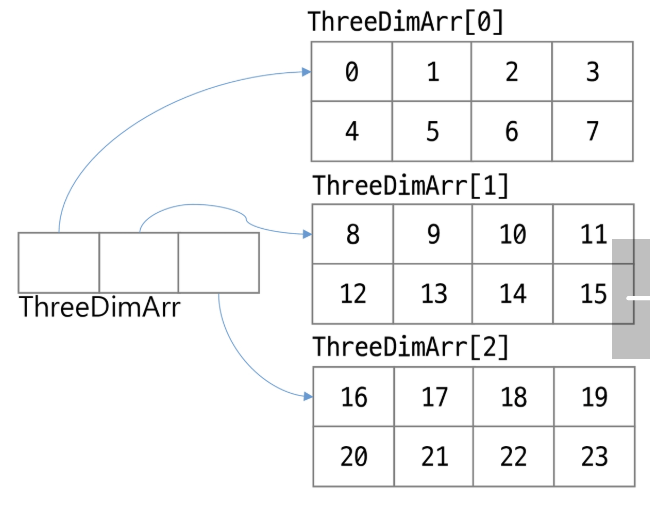

## 다차원 배열(Multidimensional Array)
- 배열 안에 또 다른 배열을 포함하는 구조
- 일반적으로 2차원 배열(행렬 형태)가 많지만 3차원 이상도 가능
- 표 형태 혹은 복잡한 계층 구조를 표현할 때 유용

- 배열 객체의 참조 값을 요소로 갖는 배열
- 2차원 배열은 배열 요소로 1차원 배열의 참조를 가지는 배열
- 3차원 배열은 배열 요소로 2차원 배열의 참조를 가지는 배열
- ...
- n차원 배열은 배열의 요소로 n-1차원 배열의 참조를 가지는 배열
- n차원 배열의 요소에 접근하기 위해서는 n개의 인덱스가 필요

### 3차원 배열
- 2행 3열의 2차원 배열 3개를 담을 수 있는 배열
~~~Java
int[][][] ThreeDimArr = new int[3][2][3]
~~~
