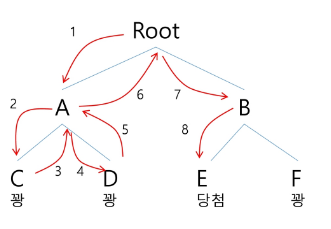

## 백트래킹 응용
### 문제 제시: N-Queen 문제
- n x n 서양 장기판에서 배치한 Queen들이 서로 위협하지 않도록 n개의 Queen을 배치하는 문제
    - 어떤 두 Queen도 서로를 위협하지 않아야 함
    - Queen을 배치한 n개의 위치는?
    
### 백트래킹(Backtracking) 개념
- 여러 가지 선택지(옵션)들이 존재하는 상황에서 한가지를 선택함
- 선택이 이루어지면 새로운 선택지들의 집합이 생성됨
- 이런 선택을 반복하면서 최종 상태에 도달함
    - 올바른 선택을 계속하면 목표 상태(goal state)에 도달함
    
### 당첨 리프 노드 찾기
- 루프에서 갈 수 있는 노드를 선택함
- 꽝 노드까지 도달하면 최근의 선택으로 되돌아와서 다시 시작함
- 더 이상의 선택지가 없다면 이전의 선택지로 돌아가서 다른 선택을 함
- 루트까지 돌아갔을 경우 더 이상 선택지가 없다면 찾는 답이 없음

  
### 백트래킹과 깊이 우선 탐색과의 차이
- 어떤 노드에서 출발하는 경로가 해결책으로 이어질 것 같지 않으면 더 이상 그 경로를
따라가지 않음으로써 시도의 횟수를 줄임 (Prunning 가지치기)

- 깊이 우선 탐색이 모든 경로를 추적하는데 비해 백트래킹은 불필요한 경로를 조기에 차단

- 깊이 우선 탐색을 가하기에는 경우의 수가 너무나 많음. 즉, N!가지의 경우의 수를 가진 문제에 대해
깊이 우선 탐색을 가하면 당연히 처리 불가능한 문제
  
- 백트래킹 알고리즘을 적용하면 일반적으로 경우의 수가 줄어들지만 이 역시 최악의 경우에는
여전히 지수함수 시간(Exponential Time)을 요하므로 처리 불가능

### 백트래킹 기법
- 어떤 노드의 유망성을 점검한 후에 유망(promising)하지 않다고 결정되면 그 노드의 부모로 되돌아가(backtracking) 다음 자식 노드로 감
- 어떤 노드를 방문하였을 때 그 노드를 포함한 경로가 해답이 될 수 없으면 그 노드는 유망하지 않다고 하며, 반대로 해답의 간으성이 있으면 유망하다고 함
- 가지치기(prunning): 유망하지 않는 노드가 포함되는 경로는 더 이상 고려하지 않음

### 백트래킹을 이용한 알고리즘은 다음과 같은 절차로 진행됨
1. 상태 공간 트리의 깊이 우선 검색을 실시함
2. 각 노드가 유망한지를 점검함
3. 만일 그 노드가 유망하지 않으면, 그 노드의 부모 노드로 돌아가서 검색을 계속함

### 일반 백트래킹 알고리즘
~~~
checknode(node v)
    IF promising(v)
        IF there is a solution at v
            write the solution
        ELSE
            FOR each child u of v
                checknode(u)
~~~

### 깊이 우선 검색 vs 백트래킹
- 순수한 깊이 우선 검색 = 155노드
- 백트래킹 = 27 노드

### 상태공간트리를 구축하여 문제를 해결
~~~
bool backtrack(선택 집합, 선택한 수, 모든 선택수)
{
    if (선택한 수 == 모든 선택수)  // 더 이상 탐색할 노드가 없다.
    {
        찾는 솔루션인지 체크;
        return 결과;
    }
    
    현재 선택한 상태집합에 포함되지 않는 후보 선택들(노드) 생성
    
    모든 후보 선택들에 대해
    {
        선택 집합에 하나의 후보선택을 추가
        선택한 수 = 선택한 수 + 1
        결과 = backtrack호출(선택집합, 선택한 수, 모든 선택수)
        
        if (결과 == 성공)
            return 성공;  // 성공한 경우 상위로 전달
    }
    return 실패;
}

~~~

