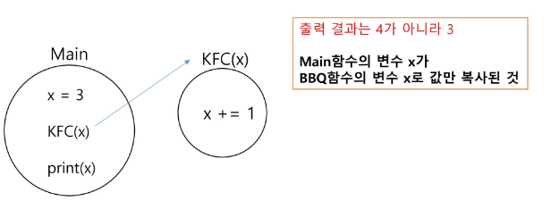

## 반복(Iteration)과 재귀(Recursion)
- 반복과 재귀는 유사한 작업을 수행할 수 있음
  

- 반복은 수행하는 작업이 완료될 때 까지 계속 반복
    - 루프 (for, while 구조)
    - 반복문은 코드를 n번 반복시킬 수 있음
  

- 재귀는 주어진 문제의 해를 구하기 위해 동일하면서 더 작은 문제의 해를 이용하는 방법
    - 하나의 큰 문제를 해결할 수 있는 (해결하기 쉬운) 더 작은 문제로 쪼개고 결과들을 결합함
    - 재귀호출은 n 중 반복문을 만들어낼 수 있음
  

- 반복문으로는 n번 반복을 구현할 수 있고, 재귀호출로 n 중 for문을 구현할 수 있음

### 재귀를 연습하기 전, 알아야 할 함수의 특징 1
- KFC 함수 호출할 때, int 타입 객체를 전달하면 값만 복사가 됨
  

- 아래 예시에서 main 함수의 x와 KFC함수의 x는 서로 다른 객체임
  (마치 한국 사는 KIM과, 미국 사는 KIM이 이름만 같고, 서로 다른 사람인 것 처럼)
  
  

- KFC 함수 호출할 때, int 타입 객체를 전달하면 값만 복사가 됨

### 재귀를 연습ㅎ하기 전, 알아야 할 함수의 특징 2
- 함수가 끝나면, Main으로 되돌아 오는 것이 아니라, 해당 함수를 호출했던 곳으로 돌아옴

  
### 재귀호출 공부의 시작은 무한 재귀호출을 막는 것 부터 시작함

### 재귀호출 코드가 1개

### 재귀호출 코드가 2개

### 재귀호출 코드가 2개, 간략화 하여 그리기 1

### 재귀호출 코드가 2개, 간략화 하여 그리기 2

### 정리

