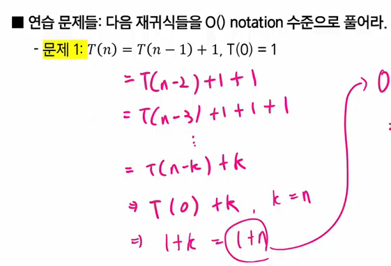
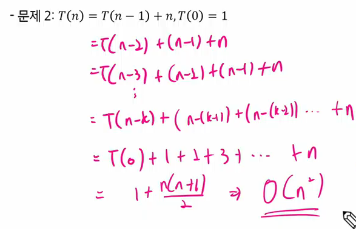
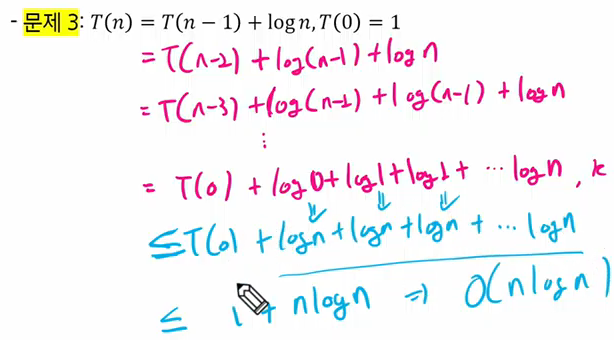
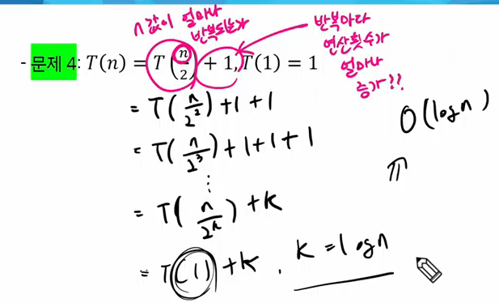

### 기초 수식 설명
- 알고리즘이 시간 복잡도를 표현할 수 있는 다양한 수식들이 존재함
- 풀이법을 익혀 두어야 알고리즘의 시간 복잡도를 계산할 수 있고, 알고리즘잉 시간이 얼마나 걸릴 지 예측할 수 있음

문제1

    => O(n)

문제2
  
    => O(n2)

문제3
  

문제4
  

### 기초 수식 정리
- 알고리즘의 효율성을 분속 + 최적화
    -> 매우매우 중요
- 키워드
    1. N값이 몇 번 반복되어야 하는가 ?
    2. 반복마다 연산횟수가 어떻게 증가하는가 ?

