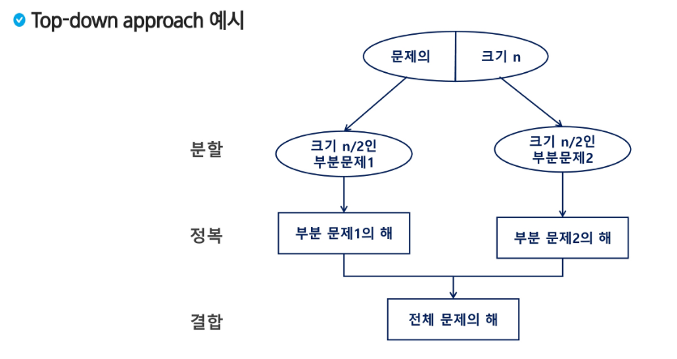
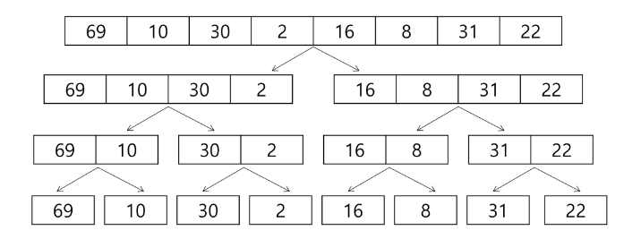
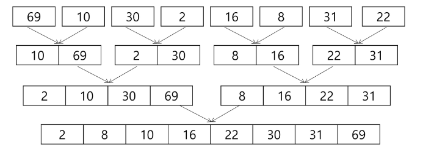
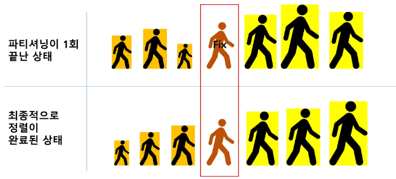
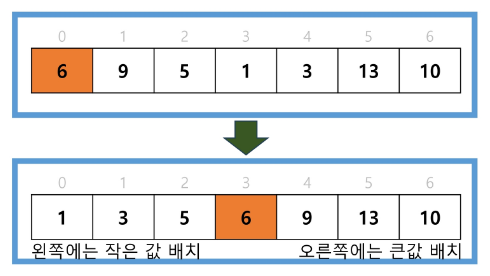
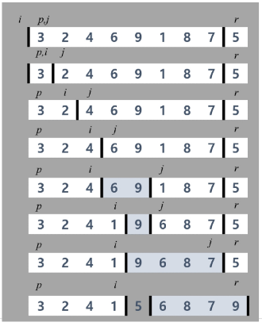
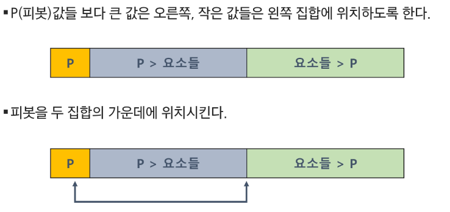
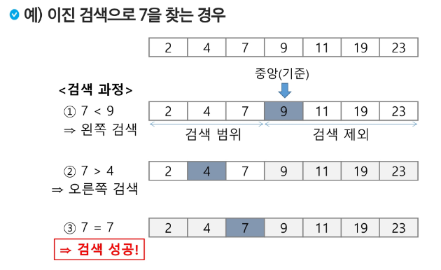
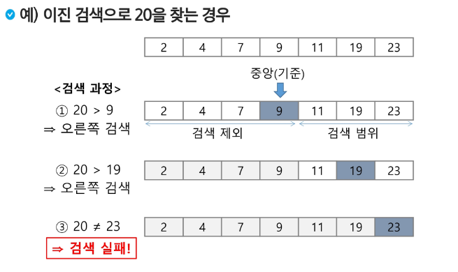

## 분할 정복
### 문제 제시: 가짜 동전 찾기
- n개의 동전들 중에 가짜 동전이 하나 포함되어 있다. 가짜 동전은 진짜 동전에 비해 아주 조금 가볍다.
진짜 동전들의 무게가 동일하다고 할 때 양팔 저울을 이용해서 가짜 동전을 찾아보자.
  
- 양팔 저울을 최소로 사용해서 가짜 동전을 찾는 방법은 무엇인가?

### 분할 정복 기법
- 유래
    - 1805년 12월 2일 아우스터리츠 전투에서 나폴레옹이 사용한 전략
    - 전력이 우세한 연합군을 공격하기 위해 나폴레옹은 연합군의 중앙부로 쳐들어가 연합군을 둘로 나눔
    - 둘로 나뉜 연합군을 한 부분씩 격파함
    

- 설계 전략
    - 분할(Divide): 해결할 문제를 여러 개의 작은 부분으로 나눔
    - 정복(Conquer): 나눈 작은 문제를 각각 해결함
    - 통합(Combine): (필요하다면) 해결된 해답을 모음
    

### Top-down approach 예시

### 분할 정복 기법 예시
- 분할 정복 기법을 거듭 제곱 문제를 통해 이해해보자
- 자연수 C의 n 제곱 값을 구하는 함수를 구현해보자

### 반복(Iterative) 알고리즘: O(n)
~~~
Iterative_Power(x,n)
    result <- 1

    FOR i in 1 -> n
        result <- result * x

    RETURN result
~~~

### 분할 정복 기반의 알고리즘: O(log n)
~~~
Recursive_Power(x, n)
  IF n == 1: RETURN x
  IF n is even
    y <- Recursive_Power(x, n/2)
    RETURN y * y
  ELSE
    y <- Recursive_Power(x, (n-1)/2)
    RETURN y * y * x
~~~

## 병합 정렬(Merge Sort)
- 여러 개의 정렬된 자료의 집합을 병합하여 한 개의 정렬된 집합으로 만드는 방식
- 분할 정복 알고리즘 활용
  - 자료를 최소 단위의 문제까지 나눈 후에 차례대로 정렬하여 최종 결과를 얻어냄
  - top-down 방식
  
- 시간 복잡도: O(n log n)

### 병합 정렬 과정
- {69, 10, 30, 2, 16, 8, 31, 22}를 병합 정렬하는 과정
- 분할 단계: 전체 자료 집합에 대하여, 최소 크기의 부분집합이 될 때까지 분할 작업을 계속함

  

- 병합 단계: 2개의 부분집합을 정렬하면서 하나의 집합으로 병합
- 8개의 부분집합이 1개로 병합될 때까지 반복함

  
### 알고리즘: 분할 과정
~~~
merge_sort(LIST m)
  IF length(m) == 1: RETRUN m
  
  LIST left, right
  middle <- length(m) / 2
  FOR x in m before middle
    add x to left
  FOR x in m after or equal middle
    add x to right
    
  left <- merge_sort(left)
  right <- merge_sort(right)
  
  RETURN merge(left, right)
~~~

### 알고리즘: 병합 과정
~~~
merge(LIST left, LIST right)
  LIST result
  
  WHILE length(left) > 0 OR length(right) > 0
    IF length(left) > 0 AND length(right) > 0
      IF first(left) <= first(rigth)
        append popfirst(left) to result
      ELSE
        append popfirst(right) to result
        
    ELIF length(left) > 0
      append popfirst(left) to result
    
    ELIF length(right) > 0
      append popfirst(right) to result
  
  RETURN result
~~~

## 퀵 정렬
- 주어진 배열을 두 개로 분할하고, 각각을 정렬한다.
  - 병합 정렬과 동일?
    - 다른 점1: 병합 정렬은 그냥 두 부분으로 나누는 반면에, 퀵 정렬은 분할할 때, 기준 아이템(pivot item)중심으로 분할함
      - 기준보다 작은 것은 왼편, 큰 것은 오른편에 위치시킴
  
    - 다른 점2: 각 부분이 정렬이 끝난 후, 병합정렬은 "병합"이란 후처리 작업이 필요하나, 퀵 정렬은 필요로 하지 않음
  
### Quick Sort는 Partitioning 이라는 과정을 반복하면서, 평균 시간복잡도 O(nlogn) 속도라는 빠른 속도로 정렬이 되는 Sort임

### 퀵 정렬 - Partitioning
1. 작업영역을 정함
2. 작업영역 중 가장 왼쪽에 있는 수를 Pivot이라고 함 
   (Pivot을 "기준"으로 해석함)
   
3. Pivot을 기준으로 왼쪽에는 Pivot보다 작은 수를 배치함 (정렬 안됨) 
  오른쪽에는 Pivot보다 큰 수를 배치시킴 (정렬 안됨)
   
4. 파티셔닝이 끝나고 Pivot의 위치는 확정(Fix) 됨 
  즉, 정렬이 다 되었을 때에도 Pivot의 위치는 지금 위치 그대로 배정됨

   
### 리스트에서 파티셔닝 하기
- 작업 영역을 0 ~ 6으로 정했을 때 예시
- Pivot을 위치를 왼쪽 첫번째 값으로 결정함

  

- 알고리즘
~~~
 quickSort(A[], l, r)
  if l < r
    s <- partition(a, l, r)
    quickSort(A[], l, s-1)
    quickSort(A[], s+1, r)
~~~

- Hoare-Partition 알고리즘
~~~
partition(A[], l, r)
  p <- A[L]  //p: 피봇 값
  i <- l, j <- r
  WHILE i <= j
    WHILE i <= j and A[i] <= p:
      i++
    WHILE i <= j and A[j] >= p:
      j--
    IF i < j:
      swap(A[i], A[j])
      
    swap(A[l], A[j])
    RETURN j
~~~

- Lomuto partition 알고리즘
~~~
partition(A[], p, r)
  x <- A[r]
  i <- p - 1
  
  FOR j in p -> r - 1
    IF A[j] <= x
      i++, swap(A[i], A[j])
      
  swap(A[i+1], A[r])
  RETURN i + 1
~~~

### 아이디어

## 이진 검색(Binary Search)
- 자료의 가운데에 있는 항목의 키 값과 비교하여 다음 검색의 위치를 결정하고 검색을 계속 진행하는 방법
  - 목적 키를 찾을 때까지 이진 검색을 순환적으로 반복 수행함으로써 검색 범위를 반으로 줄여가면서 보다 빠르게 검색을 수행함
  

- 이진 검색을 하기 위해서는 자료가 정렬된 상태여야 함

### 검색 과정
1. 자료의 중앙에 있는 원소를 고름
2. 중앙 원소의 값과 찾고자 하는 목표 값을 비교함
3. 목표 값이 중앙 원소의 값보다 작으면 자료의 왼쪽 반에 대해서 새로 검색을 수행하고, 크다면 자료의 오른쪽 반에 대해서 새로 검색을 수행함
4. 찾고자 하는 값을 찾을 때까지 1~3의 과정을 반복함

   

### 알고리즘: 반복구조
~~~
binarySearch(n, S[], key)
  low <- 0
  high <- n - 1
  
  WHILE low <= high
    mid <- low + (high - low) / 2
    
    IF S[mid] == key
      RETURN mid
    ELIF S[mid] > key
      high <- mid - 1
    ELSE
      low <- mid + 1
  RETURN -1
~~~

### 알고리즘: 재귀구조
~~~
binarySearch(a[], low, high, key)
  IF low > high
    RETURN -1
  ELSE
    mid <- (low + high) / 2
    IF key == a[mid]
      RETURN mid
    ELIF key < a[mid]
      RETURN binarySearch(a[], low, mid-1, key)
    ELSE
      RETURN binarySearch(a[], mid+1, high, key)
~~~

## 분할 정복 알고리즘 정리
- 병합 정렬
  - 외부 정렬(External Sort)의 기본이 되는 정렬 알고리즘
  - 멀티코어 CPU나 다수의 프로세서에서 정렬 알고리즘을 병렬화하기 위해 병합 정렬 알고리즘이 활용됨
  

- 퀵 정렬
  - 매우 큰 입력 데이터에 대해서 좋은 성능을 보이는 알고리즘
  

- 이진 검색
  - 정렬된 데이터를 기준으로 특정 값이나 범위를 검색하는 데 사용
  - [이진 검색을 활용한 심화 학습 키워드] Lower Bound, Upper Bound
    - 정렬된 배열에서 특정 값 이상(이하)가 처음으로 나타나는 위치를 찾는 알고리즘
    - 특정 데이터의 범위 검색 등에서 활용