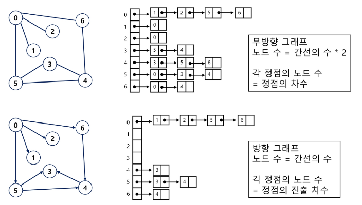

## BFS(Breadth First Search)
- 너비우선탐색은 탐색 시작점의 인접한 정점들을 먼저 모두 차례로 방문한 후에,
방문했던 정점을 시작점으로 하여 다시 인접한 정점들을 차례로 방문하는 방식
  
- 인접한 정점들에 대해 탐색을 한 후, 차례로 다시 너비우선탐색을 진행해야 하므로, 
  선입선출 형태인 자료구조인 큐를 활용함
  

### 입력 파라미터: 그래프 G와 탐색 시작점 v
~~~
BFS(G, v)  // 그래프 G, 탐색 시작점 v
    큐 생성
    시작점 v를 큐에 삽입
    점 v를 방문한 것으로 표시
    WHILE 큐가 비어있지 않은 경우
        t <- 큐의 첫번째 원소 반환
        FOR t와 연결된 모든 선에 대해
            u <- t의 이웃점
            u가 방문되지 않은 곳이며,
            u를 큐에 넣고, 방문한 것으로 표시
~~~