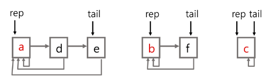

## 서로소 집합(Disjoint-sets)
- 서로소 또는 상호배타 집합들은 서로 중복 포함된 원소가 없는 집합
-> 다시 말해 교집합이 없음
  
- 집합에 속한 하나의 특정 멤버를 통해 각 집합들을 구분함. 이를 대표자(representative)라 함

- 상호배타 집합을 표현하는 방법
    - 연결 리스트
    - 트리
    
- 상호배타 집합 연산
    - Make-Set(x) : 자기 자신을 대표자로 설정 => x 개의 집합을 생성
    - Find-Set(x) : 대표자가 누구냐 ??
    - Union(x, y) : x, y를 하나의 집합으로 묶자
    

### 상호 배타 집합 표현 - 연결리스트
- 같은 집합의 원소들은 하나의 연결리스트로 관리함
- 연결리스트의 맨 앞의 원소를 집합의 대표 원소로 삼음
- 각 원소는 집합의 대표원소를 가리키는 링크를 가짐

  

- 하나의 집합 (a disjoint set)을 하나의 트리로 표현함
- 자식 노드가 부모 노드를 가리키며 루트 노드가 대표자가 됨

  

### 연산 예

### 상호 배타 집합에 대한 연산
- Make-Set(x): 유일한 멤버 x를 포함하는 새로운 집합을 생성하는 연산
~~~
Make-Set(x)
  p[x] <- x
~~~

- Find_Set(x): x를 포함하는 집합을 찾는 연산
~~~
Find-Set(x)
  IF x == p[x]: RETURN x
  ELSE : RETURN Find_Set(p[x])
~~~

- Union(x, y): x와 y를 포함하는 두 집합을 통합하는 연산
~~~
Union(x, y)
  p[Find-Set(y)] <- Find-Set(x)
~~~

### 참고
- Find_Set(x): x를 포함하는 집합을 찾는 연산(반복)
~~~
Find-Set(x)
  while x != p[x]
    x = p[x]
  return x
~~~

### 연산의 효율을 높이는 방법
- Rank를 이용한 Union
  - 각 노드는 자신을 루트로 하는 subtree의 높이를 랭크 Rank라는 이름으로 저장함
  - 두 집합을 합칠 때 rank가 낮은 집합을 rank가 높은 집합에 붙임
  
- Path compression
  - Find-Set을 행하는 과정에서 만나는 모든 노드들이 직접 root를 가리키도록 포인터를 바꾸어 줌
  

### Make_Set() 연산
- Make_Set(x): 유일한 멤버 x를 포함하는 새로운 집합을 생성하는 연산
~~~
p[x]: 노드 x의 부모 저장
rank[x]: 루트 노드가 x인 트리의 랭크 값 저장

Make_Set(x)
  p[x] <- x
  rank[x] <- 0
~~~

### Find_Set() 연산
- Find_Set(x): x를 포함하는 집합을 찾는 오퍼레이션
~~~
Find_Set(x)
  IF x != p[x]  // x가 루트가 아닌 경우
    p[x] <- Find_Set(p[x])
  RETURN p[x]
~~~

- Find_set 연산은 특정 노드에서 루트까지의 경로를 찾아가면서 노드의 부모 정보를 갱신함

### Union 연산
- Union(x, y): x와 y를 포함하는 두 집합을 통합하는 오퍼레이션
~~~
Union(x, y)
  Link(Find_Set(x), Find_Set(y))
~~~

~~~
Link(x, y)
  IF rank[x] > rank[y]  // rank는 트리의 높이
    p[y] <- x
  ELSE
    p[x] <- y
    IF rank[x] == rank[y]
      rank[y]++
~~~ 

