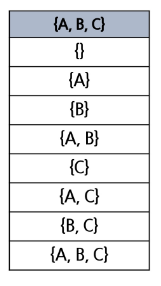
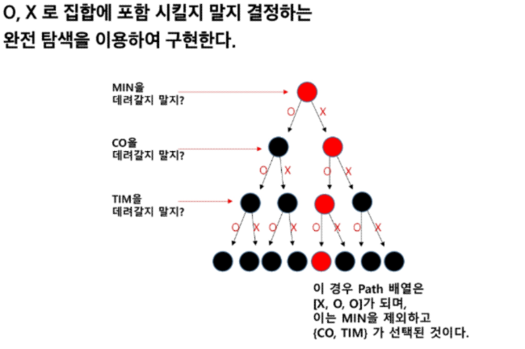
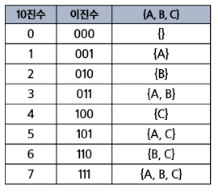

## 부분 집합
- 집합에 포함된 원소들을 선택하는 것

### 부분 집합 예시
- 아래 표는 집합 {A, B, C}로 만들 수 있는 부분집합의 예시
- 부분집합에는 아무것도 선택하지 않은 경우도 집합에 포함됨 (= 공집합)

### 집합에서 부분 집합을 찾아내는 구현 방법
1. 완전탐색
- 재귀호출을 이용한 완전탐색으로, 부분 집합을 구할 수 있음
- 실전 보다는 완전 탐색 학습용으로 추천하는 방법

2. Binary Counting
- 2진수 & 비트연산을 이용하여, 부분 집합을 구할 수 있음
- 부분 집합이 필요할 때 사용하는 추천 방법

### 바이너리 카운팅(Binary Counting)
- 원소 수에 해당하는 N개의 비트열을 이용함
- 0 0 1 이면 {A}임을 나타냄
- 1 1 0 이면 {B, C}임을 나타냄

