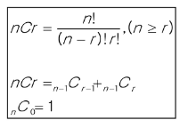

## 조합
- 서로 다른 n개의 원소 중 r개를 순서 없이 골라낸 것을 조합(combination)이라고 부름

### 순열과 조합 차이
- 순열: {A, B, C, D, E} 5명 중 1등, 2등, 3등 뽑기
    - A B C 와 C B A 는 다른 경우
    
- 조합: 5명 중 3명 뽑기
    - A B C 와 C B A 는 같은 경우
    

### For문으로 조합 구현하기
- 5명중 3명 뽑는 조합은 3중 for문으로 구현이 가능
~~~python
arr = ['A', 'B', 'C', 'D', 'E']
n = len(arr)

for a in range(n):
    start1 = a + 1
    
    for b in range(start1, 5):
        start2 = b + 1
        
        for c in range(start2, 5):
            print(arr[a], arr[b], arr[c])
~~~

### 만약 5명 중 3명을 뽑는 코드는 몇 중 for문이 필요할까?
- 3중 for로 구현이 가능함

### 만약 5명 중 n명을 뽑는 코드는 몇 중 for문이 필요할까?
- n중 for로 구현이 가능. 즉, 재귀호출 구현이 필요
- Branch: 최대 5개
- Level: n