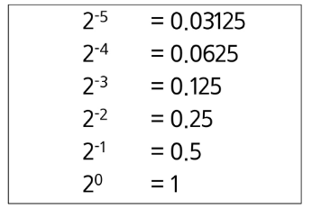
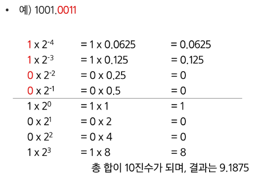
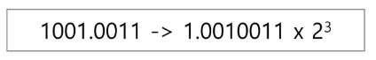

## 실수
### 파이썬에서 실수 출력 방법
- 파이썬은 f-string 문법을 지향함
~~~python
t1 = 10
t2 = 3.141592

print(f'변수 값은 {t1} 입니다.')  # 변수 값은 10 입니다.
print(f'변수 값은 {t2} 입니다.')  # 변수 값은 3.141592 입니다.
~~~

### 소수점 출력 방법
- {t2:.2f}: t2 값을 소수점 둘째자리에서 반올림하여 표현
~~~python
t1 = 10
t2 = 3.141592

print(f'변수 값은 {t1} 입니다.')  # 변수 값은 10 입니다.
print(f'변수 값은 {t2:.2f} 입니다.')  # 변수 값은 3.14 입니다.
~~~

### 파이썬에서의 실수 표현 범위를 알아보자
- 파이썬에서는 다른 언어와 달리 내부적으로 더 큰 규모의 자료구조를 사용해서 훨씬 넓은 범위의 실수를 표현할 수 있음
- 최대로 표현할 수 있는 값은 약 1.8 x 10308이고 이 이상은 inf로 표현
  (참고로 1억은 1 x 108)
- 최소로 표현할 수 있는 값은 약 5.0 x 10-324이며, 이 이하는 0으로 표현

### 컴퓨터는 실수를 내부적으로 근사적으로 관리함
- 실수는 정확한 값이 아니라 근사 값으로 저장되는데 이때 생기는 작은 오차가 계산 과정에서 다른 결과를 가져옴
~~~python
print(0.1 + 0.1 + 0.1 == 0.3)  # False
~~~

### 소수점이 있는 10진수를 2진수로 변환 예시
0.75 = 2-1 + 2-2 = 0.11(2) 
0.40625 = 2-2 + 2-3 + 2-5 = 0.011012 

### 소수점을 포함한 2진 실수를 10진수로 변환하는 예시

### 실수의 표현
- 컴퓨터는 실수를 표현하기 위해 부동 소수점(floating-point) 표기법을 사용함
- 이 표기법은 IEEE 754 이라는 컴퓨터에서 부동소수점을 표기하는 국제표준임
- 부동 소수점 표기 방법은 소수점의 위치를 고정시켜 표현하는 방식
- 소수점의 위치를 왼쪽의 가장 유효한 숫자 다음으로 고정시키고 밑수의 지수승으로 표현

### 실수를 저장하기 위한 형식 (IEEE 754, 32bit - Single Precision 표기법 기준)
- 32bit 구조

  
- 부호 1비트: 0 이면 양수, 1 이면 음수
- 지수부(exponent): 부동소수점의 크기 + bias값
- 가수부(mantissa): 실질적 수

### 12.375를 부동소수점으로 표기
- 12.375를 2진수로 변환: 12는 1100, 0.375는 0.011이므로 1100.011
- 1100.011 = 1.100011 x 2^3
    즉, 가수는 100011이고, 지수는 3. (맨 앞 1은 생략)
  
### 지수 + bias: IEEE 754는 bias를 더한 결과로 표기
- 3 + 127(bias) = 130 (2진수로는 10000010)

### 12.375룰 IEEE754로 표기하는 방법
- 부호 비트: 0(양수)
- 지수: 10000010
- 가수: 1000110000000000000000

### 컴퓨터는 실수를 근사적으로 표현함
- 이진법으로 표현 할 수 없는 형태의 실수는 정확한 값이 아니라 근사 값으로 저장되는데 이때 생기는 작은 오차가 계산 과정에서 다른 결과를 가져옴

### 실수 자료형의 유효 자릿수를 알아 두자
- 32 비트 실수형 유효자릿수(십진수) -> 약 6자리(C++)
- 64 비트 실수형 유효자릿수(십진수) -> 약 15자리(C++, Java)
- 파이썬에서는 내부적으로 더 많은 비트를 사용해서 훨씬 넓은 범위의 실수를 표현할 수 있음
