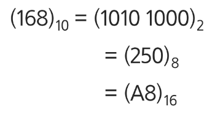
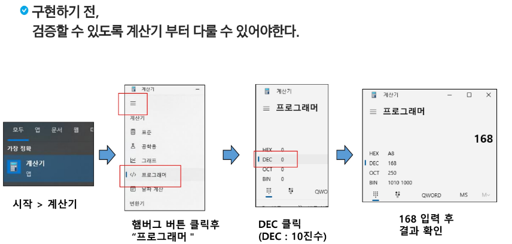
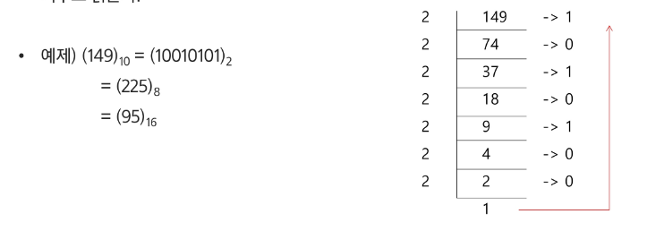
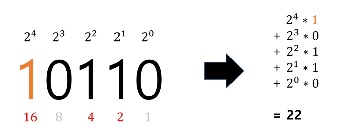
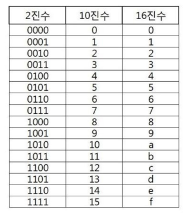

## 진수
### 2진수, 8진수, 10진수, 16진수
- 10진수: 사람이 사용하는 진수, 수 하나를 0~9로 표현
- 2진수: 컴퓨터 사용하는 진수, 수 하나를 0, 1로 표현
- 8진수: 2진수를 더 가독성 있게 사용
- 16진수: 2진수를 더 가독성 있게 사용, 수 하나를 0, 1, ... 8, 9, A, B, C, D, E, F 로 표현

### 왜 16진수를 사용하는 것인가?
- 2진수를 사람이 이해하기 편하도록, 10진수로 변환 시
    -> 인간이 이해하기 편하지만, 연산이 오래 걸림

- 2진수를 사람이 이해하기 편하도록, 16진수로 변환 시
    -> 인간이 이해하기 어렵지만, 연산 속도가 매우 빠름

### 용어 암기
- HEX: 16진수
- DEC: 10진수
- OCT: 8진수
- BIN: 2진수

### 앞으로 학습목표
1. 2진수, 10진수, 16진수를 왜 쓰는지 이해한다.
2. 손으로 변환하는 방법을 익힌다.
3. 프로그래밍으로 진수 변환을 직접 구현한다.

## 진법 변환
### 10진수 -> 타 진수로 변환
- 원하는 타진법의 수로 나눈 뒤 나머지를 거꾸로 읽음
  

### 10진수 -> 2진수로 변환 구현
- 10진수를 지속적으로 2로 나누어 구현한다.
- 마지막으로 List를 거꾸로 뒤집는다.
~~~python
tar = 149
result = []

while tar != 0:
    result.append(tar % 2)
    tar //= 2

result.reverse()
print(result)
~~~

~~~python
target = 149

def dec_to_binary(target):
    binary_number = ""

    while target > 0:
        remain = target % 2  # 2로 나눈 나머지
        binary_number = str(remain) + binary_number
        target = target // 2  # 2로 나눈다.
    return binary_number

print(dec_to_binary(target))
~~~

### 2진수를 10진수로 변환
~~~python
def binary_to_decimal(binary_str):
    # 1. bianry_str 문자열 뒤에서 부터 진행
    # 2. 각 자리에 맞는 수를 곱하면서, 결과에 더한다.

    decimal_number = 0
    pow = 0  # 지수

    for digit in reversed(binary_str):
        if digit == '1':  # 1일 때
            decimal_number += 2 ** pow
        pow += 1

    return decimal_number

print(binary_to_decimal("1001010"))
~~~

### 16진수 <-> 2진수 변환
- 2진수, 10진수간 변환은 연산이 많으나, 2진수, 16진수간 변환은 연산이 없음
- 진법 변환을 빠르게 할 수 있으려면 우측 진수 표를 암기하는 것을 권장

### 10진수를 16진수로 변환
~~~python
target = 256

def decimal_to_hexadecimal(target):
    hex_digit = "0123456789ABCEDF"
    hex_number = ""

    while target > 0:
        remain = target % 16
        hex_number = hex_digit[remain] + hex_number
        target //= 16

    return hex_number

print(decimal_to_hexadecimal(target))
~~~