## 이진 트리
- 모든 노드들이 2개의 서브트리를 갖는 특별한 형태의 트리
- 각 노드가 자식 노드를 최대한 2개 까지만 가질 수 있는 트리
    - 왼쪽 자식 노드(left child node)
    - 오른쪽 자식 노드(right child node)
- 이진 트리의 예
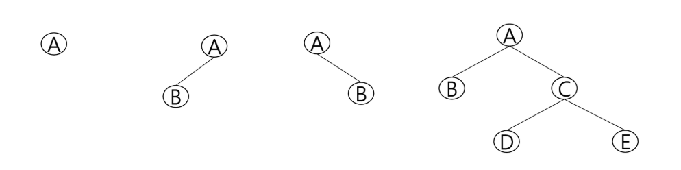

### 특성
- 레벨 i에서의 노드의 최대 개수는 2^i개
- 높이가 h인 이진 트리가 가질 수 있는 노드의 최소 개수는 (h+1)개가 되며, 최대 개수는 (2^h+1 - 1)개가 됨
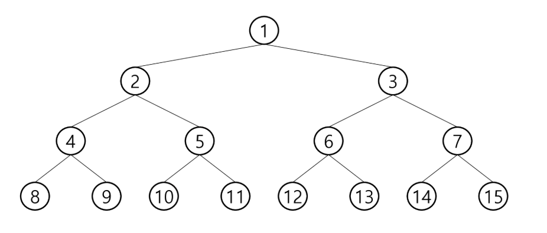

### 종류
- 포화 이진 트리(Full Binary Tree)
    - 모든 레벨에 노드가 포화상태로 차 있는 이진 트리
    - 높이가 h일 때, 최대의 노드 개수인(2^h+1 - 1)의 노드를 가진 이진 트리
        - 높이 3일 때 2^3+1 - 1 = 15개의 노드
    - 루트를 1번으로 하여 2^h+1 - 1까지 정해진 위치에 대한 노드 번호를 가짐
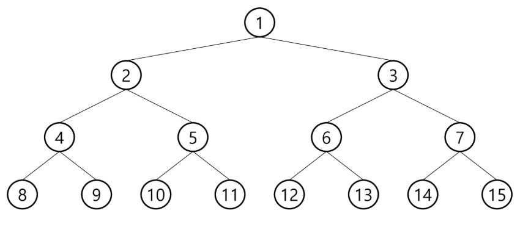

- 완전 이진 트리(Complete Binary Tree)
    - 높이가 h이고 노드 수가 n개일 때,(단, 2^h <= n <= 2^h+1 - 1), 포화 이진 트리의 노드 번호 1번부터 n번까지 빈 자리가 없는 이진 트리
    - 예) 노드가 10개인 완전 이진 트리
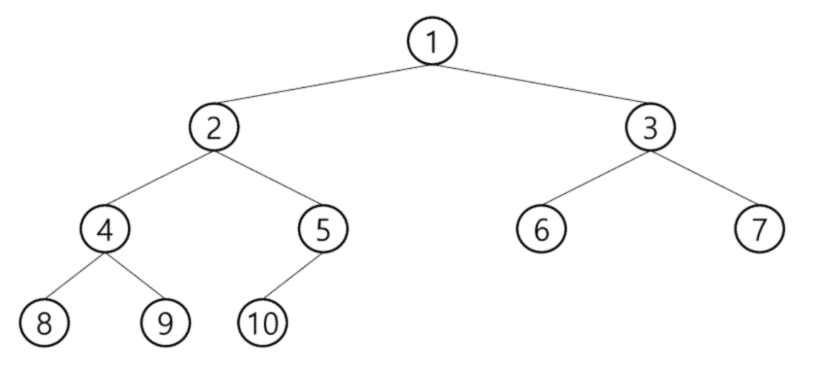

- 편향 이진 트리(Skewed Binary Tree)
    - 높이 h에 대한 최소 개수의 노드를 가지면서 한쪽 방향의 자식 노드만을 가진 이진 트리
        - 왼쪽 편향 이진 트리
        - 오른쪽 편향 이진 트리
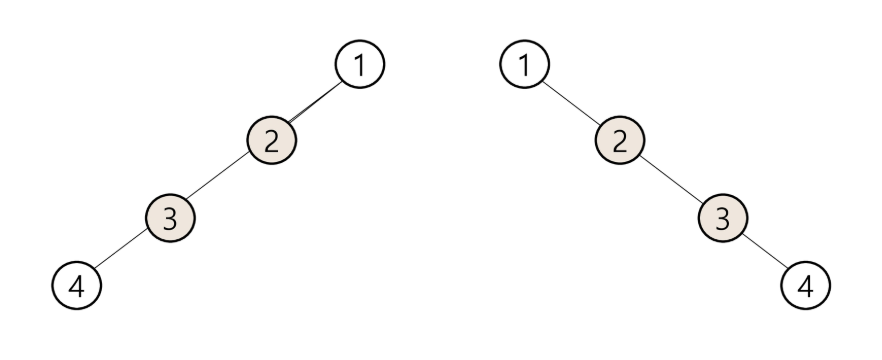

## 이진트리 순회(traversal)
- 순회(traversal)란 트리의 각 노드를 중복되지 않게 전부 방문(visit) 하는 것을 말하는데 트리는 비선형 구조이기 때문에 선형구조에서와 같이 선후 연결 관계를 알 수 없음
- 따라서 특별한 방법이 필요함

### 순회
- 트리의 노드들을 체계적으로 방문하는 것
- 3가지의 기본적인 순회방법
    - 전위순회(preorder traversal)
        - 부모노드 방문 후, 자식노드를 좌, 우 순서로 방문
    - 중위 순회(inorder traversal)
        - 왼쪽 자식노드, 부모노드, 오른쪽 자식노드 순으로 방문
    - 후위순회(postorder traversal)
        - 자식노드를 좌우 순서로 방문한 후, 부모노드로 방문함
    
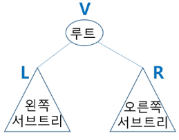

### 전위 순회(preorder traversal)
- 수행 방법
    1. 현재 노드 n을 방문하여 처리함: V
    2. 현재 노드 n의 왼쪽 서브트리로 이동함: L
    3. 현재 노드 n의 오른쪽 서브트리로 이동함: R
    
- 전위 순회 알고리즘
~~~python
def preorder_traverse(T):  # 전위순회
    if T:  # T is not None
        visit(T)  # print(T.item)
        preorder_traverse(T.left)
        preorder_traverse(T.right)
~~~

- 전위순회 예
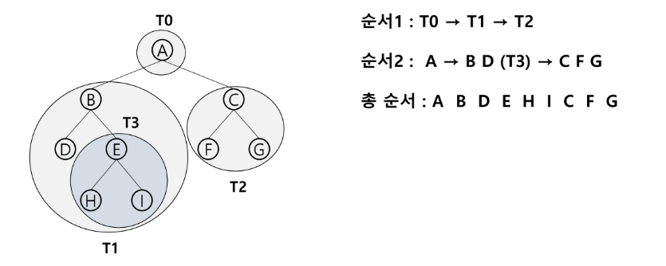

### 중위 순회(inorder traversal)
- 수행 방법
    1. 현재 노드 n의 왼쪽 서브트리로 이동함: L
    2. 현재 노드 n을 방문하여 처리함: V
    3. 현재 노드 n의 오른쪽 서브트리로 이동함: R
    
- 중위 순회 알고리즘
~~~python
def inorder_traverse(T):  # 중위순회
    if T:  # T is not None
        inorder_traverse(T.left)
        visit(T)
        inorder_traverse(T.right)
~~~

- 중위 순회의 예
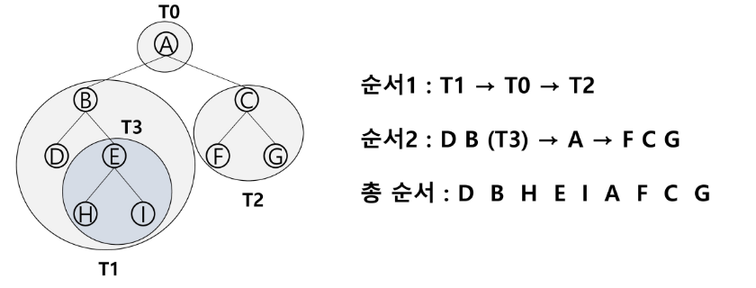

### 후위 순회(postorder traversal)
- 수행 방법
    1. 현재 노드 n의 왼쪽 서브트리로 이동함: L
    2. 현재 노드 n의 오른쪽 서브트리로 이동함: R
    3. 현재 노드 n을 방문하여 처리함: V
    
- 후위 순회 알고리즘
~~~python
def postorder_traverse(T):  # 후위순회
    if T:  # T is not None
        postorder_traverse(T.left)
        postorder_traverse(T.right)
        visit(T)
~~~

- 후위 순회의 예
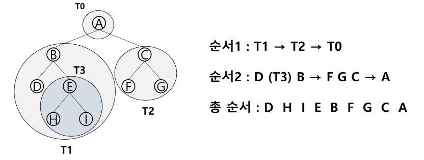

## 이진 트리의 표현 1
### 배열을 이용한 이진 트리의 표현
- 이진 트리에 각 노드 번호를 다음과 같이 부여
- 루트의 번호를 1로 함
- 레벨 n에 있는 노드에 대하여 왼쪽부터 오른쪽으로 2n부터 2n+1-1 까지 번호를 차례로 부여
- 포화 이진 트리, 완전 이진 트리에 적합
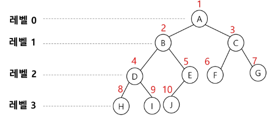

### 노드 번호의 성질
- 노드 번호가 i인 노드의 부모 노드 번호? i/2
- 노드 번호가 i인 노드의 왼쪽 자식 노드 번호? 2*i
- 노드 번호가 i인 노드의 오른쪽 자식 노드 번호? 2*i+1
- 레벨 n의 노드 번호 시작 번호는? 2n
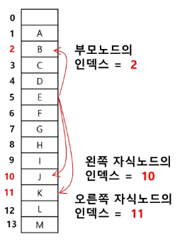
  
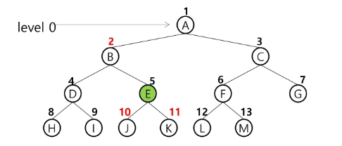

### 배열을 이용한 이진 트리의 표현
- 노드 번호를 배열의 인덱스로 사용
- 높이가 h인 이진 트리를 위한 배열의 크기는?
    - 레벨 i의 최대 노드 수는? 2i
    - 따라서 1 + 2 + 4 + 8 ... + 2i
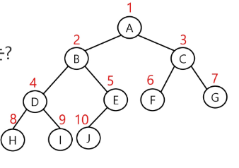
      
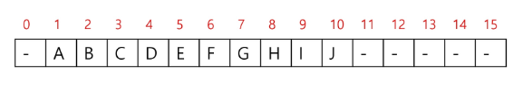

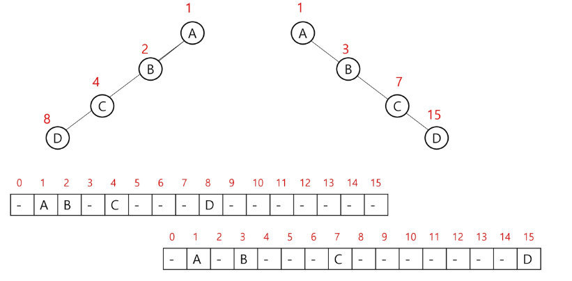

## 이진 트리 표현 2
### 부모 번호를 인덱스로 자식 번호를 저장
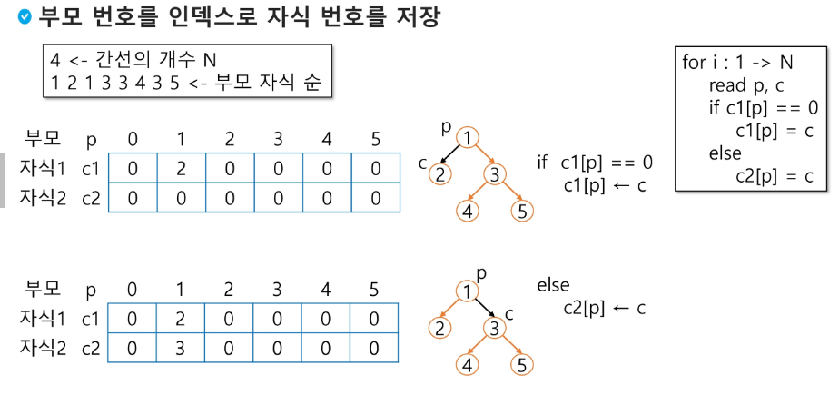

### 자식 번호를 인덱스로 부모 번호를 저장
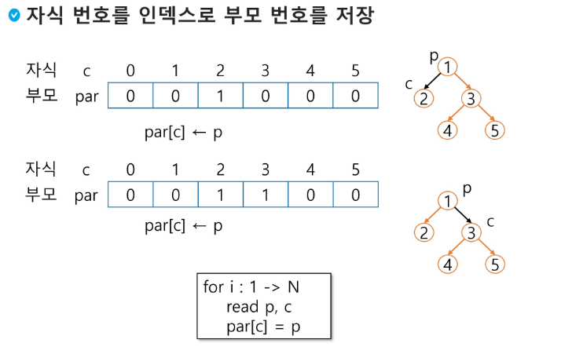

### 루트 찾기, 조상 찾기
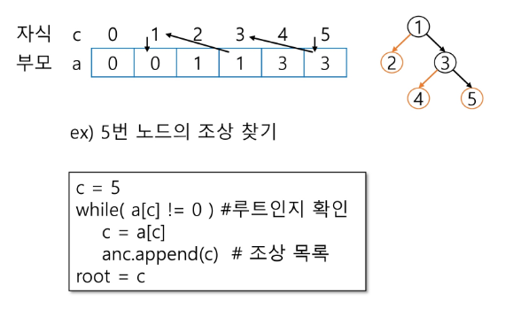

### 배열을 이용한 이진 트리의 표현의 단점
- 편향 이진 트리의 경우에 사용하지 않는 배열 원소에 대한 메모리 공간 낭비 발생
- 트리의 중간에 새로운 노드를 삽입하거나 기존의 노드를 삭제할 경우 배열의 크기 변경 어려워 비효율적

### 이진 트리의 표현 - 연결 리스트
- 배열을 이용한 이진 트리의 표현의 단점을 보완하기 위해 연결리스트를 이용하여 트리를 표현할 수 있음
- 연결 자료구조를 이용한 이진트리의 표현
    - 이진 트리의 모든 노드는 최대 2개의 자식 노드를 가지므로 일정한 구조의 단순 연결 리스트 노드를 사용하여 구현
      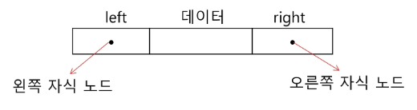

- 완전 이진 트리의 연결 리스트 표현
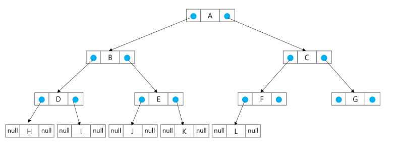
  
## 수식 트리
- 수식을 표현하는 이진 트리
- 수식 이진 트리(Expression Binary Tree)라고 부르기도 함
- 연산자는 루트 노드이거나 가지 노드
- 피연산자는 모두 잎 노드
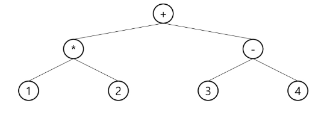

### 수식 트리의 순회
- 중위 순회: A/B*C*D+E (식의 중위 표기법)
- 후위 순회: AB/C*D*E+ (식의 후위 표기법)
- 전위 순회: +**/ABCDE (식의 전위 표기법)