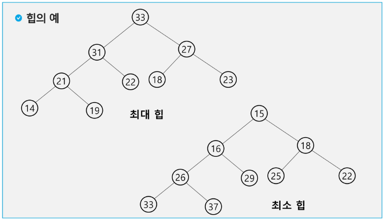
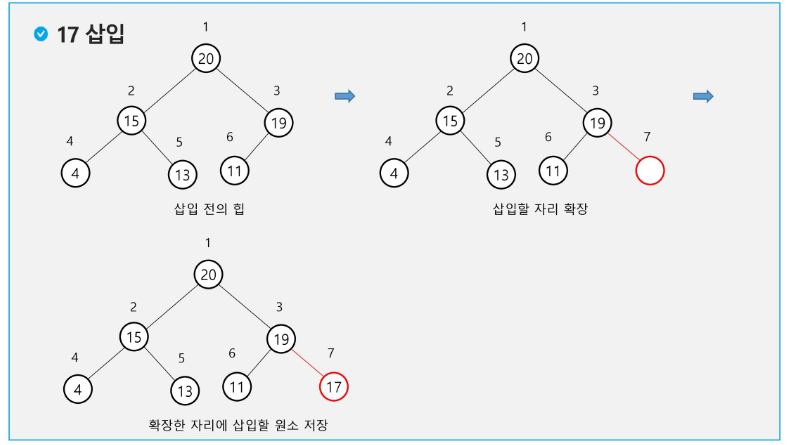
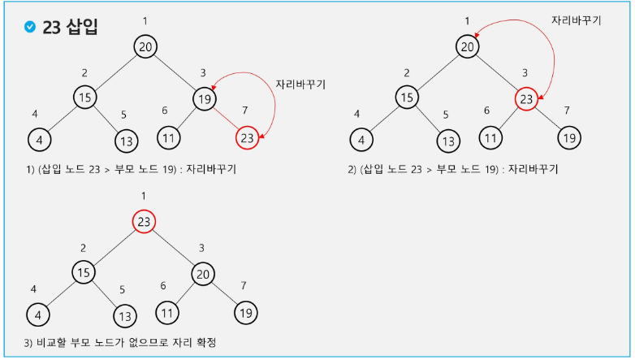
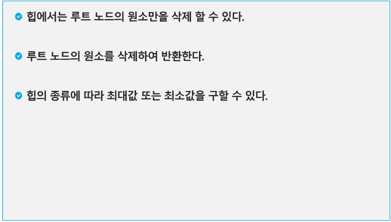
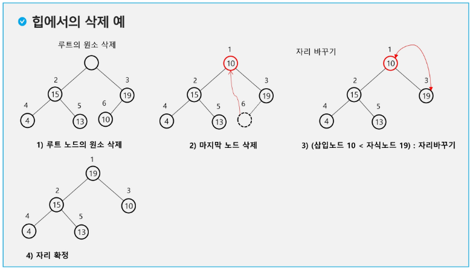
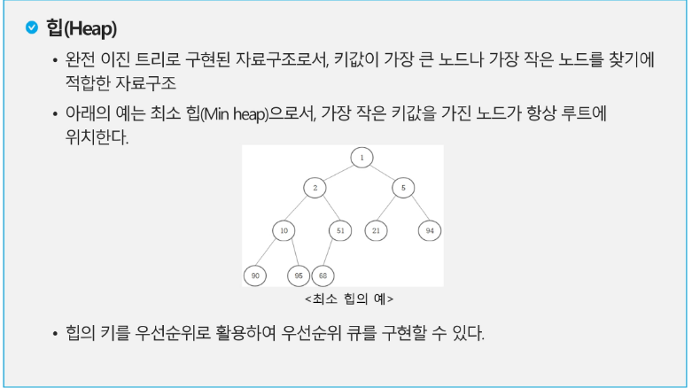

## 힙(heap)
- 완전 이진 트리에 있는 노드 중에서 키값이 가장 큰 노드나 키값이 가장 작은 노드를 찾기 위해서 만든 자료구조
- 최대 힙(max heap)
    - 키값이 가장 큰 노드를 찾기 위한 완전 이진 트리
    - {부모노드의 키값 > 자식노드의 키값}
    - 루트 노드: 키값이 가장 큰 노드
- 최소 힙(min heap)
    - 키값이 가장 작은 노드를 찾기 위한 완전 이진 트리
    - {부모노드의 키값 < 자식노드의 키값}
    - 루트 노드: 키값이 가장 작은 노드
    

### 힙 연산 - 삽입

### 힙 연산 - 삭제

### 힙을 이용한 우선순위 큐
