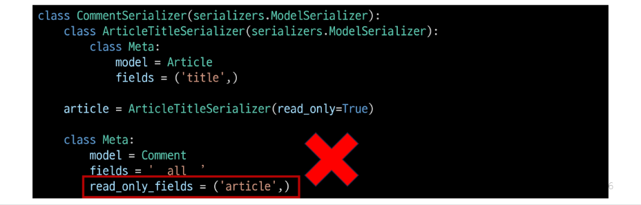

## 읽기 전용 필드
- 클라이언트가 데이터 생성 또는 수정 요청을 보낼 때 해당 필드에 값을 제공하거나 변경할 수 없으며, 서버가 응답 시에만 값을 표시하는 필드

### 읽기 전용 필드 사용 목적
- 클라이언트 측에서 직접 수정하면 안되는 경우
- 서버 로직에 의해 자동 생성, 관리되는 값 활용
- 입력은 받지 않지만 정보를 제공해야 하는 경우
- 새로운 필드 값(추가 계산, 가공)을 만들어 제공해야 하는 경우

### 읽기 전용 필드 특징 및 주의사항
- 유효성 검사에서 제외됨
  - 읽기 전용 필드는 클라이언트가 보내는 요청 데이터에서 고려되지 않으므로, 유효성 검사 대상에서 제외됨
  - 즉, 클라이언트가 해당 필드에 값을 넣어도 무시되며 검증 오류를 일으키지 않음
- 생성, 수정 요청 모두에서 적용 가능
  - 읽기 전용 필드라 해서 생성(POST) 단계에서만 무의미한 것은 아님
  - 수정(PUT) 요청에서도 해당 필드는 여전히 클라이언트 입력을 받지 않고, 응답 시에만 노출됨

### 읽기 전용 필드 정리
- 서버가 관리하거나 계산하는 값, 클라이언트가 변경할 수 없어야 하는 값, 또는 단순히 조회 목적으로 제공해야 하는 값을 나타내는 데 유용
- 이를 통해 API 응답 구조를 명확히 하고, 데이터 무결성을 유지하며, 불필요한 클라이언트 입력 처리를 방지

## 읽기 전용 필드 주의사항
- 특징 필드를 override 혹은 추가한 경우 read_only_fields는 동작하지 않음
- 이런 경우 새로운 필드에 read_only 키워드 인자로 작성해야 함

### read_only_fields 속성과 read_only 인자
- read_only_fields
  - 기존 외래 키 필드 값을 그대로 응답 데이터에 제공하기 위해 지정하는 경우
- read_only
  - 기존 외래 키 필드 값의 결과를 다른 값으로 덮어쓰는 경우
  - 새로운 응답 데이터 값을 제공하는 경우