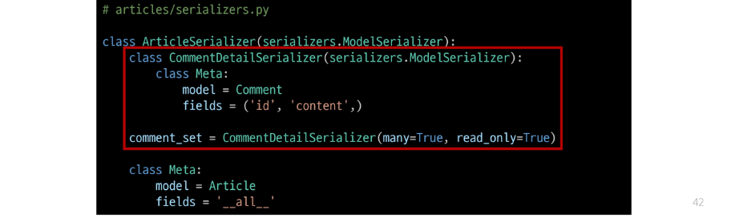
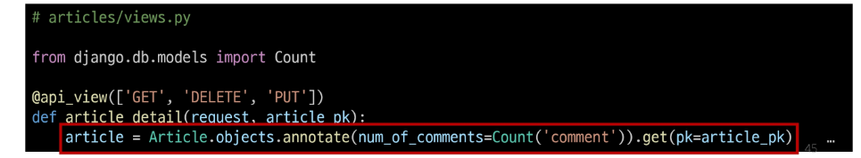
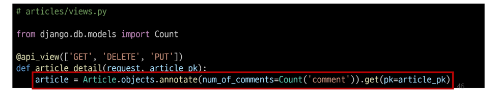
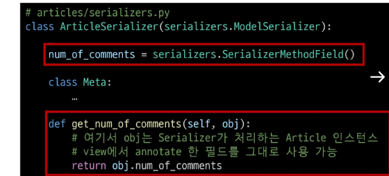
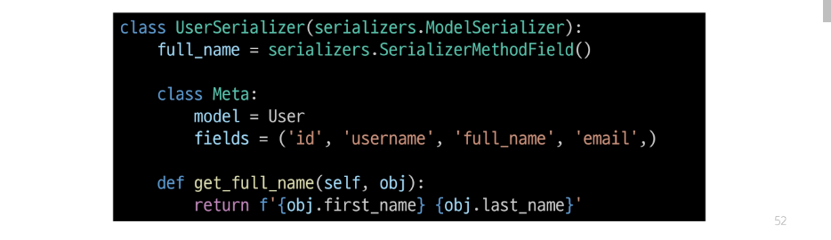

## 역참조 데이터 구성
### Article -> Comment 간 역참조 관계를 활용한 JSON 데이터 재구성
- 아래 2가지 사항에 대한 데이터 재구성하기
  1. 단일 게시글 조회 시 해당 게시글에 작성된 댓글 목록도 함께 붙여서 응답
  2. 단일 게시글 조회 시 해당 게시글에 작성된 댓글 개수도 함께 붙여서 응답

## 단일 게시글 + 댓글 목록
- Nested relationships (역참조 매니저 활용)
  - 모델 관계 상으로 참조하는 대상은 참조되는 대상의 표현에 포함되거나 중첩될 수 있음
  - 이러한 중첩된 관계는 serializers를 필드로 사용하여 표현 가능

## 단일 게시글 + 댓글 개수
### View 로직 개선: annotate 사용
- View에서 Article 객체를 조회할 때 annotate를 활용해 num_of_comments 필드를 추가
  - annotate는 Django ORM 함수로, SQL의 집계 함수를 활용하여 쿼리 단계에서 데이터 가공을 수행
- 다음과 같이 댓글 수를 세어 num_of_comments라는 필드를 추가

- 이제 serializer.data를 반환하면, 해당 article 객체에는 num_of_comments라는 "주석(annotate) 필드"가 포함되어 있음

### Serializer 개선: SerializerMethodField 사용
- SerializerMethodField는 읽기 전용 필드를 커스터마이징 하는데 사용
- 이 필드를 선언한 뒤 get_<필드명> 메서드를 정의하면, 해당 메서드의 반환 값이 직렬화 결과에 포함됨
- 이제 serializer.data를 호출할 때, get_num_of_comments 메서드가 실행되어 num_of_comments 값이 자동으로 포함됨
- 추가적으로 view에서 data를 딕셔너리로 변환하거나 수정할 필요 없이, serializer.data를 바로 반환해도 최종 JSON 응답에 num_of_comments 값이 반영됨

## SerializerMethodField
- DRF에서 제공하는 읽기 전용 필드
- Serializer에서 추가적인 데이터 가공을 하고 싶을 때 사용
  - 예: 특정 필드 값을 조합해 새로운 문자열 필드를 만들거나, 부가적인 계산(비율, 합계, 평균)을 하는 경우 등

### SerializerMethodField 동작 원리
- SerializerMethodField를 Serializer 클래스 내에서 필드로 선언하면, DRF는 get_<필드명>이라는 이름을 가진 메서드를 자동으로 찾음
- 예를 들어,  full_name = serializers.SerializerMethodField()라고 선언하면, DRF는 get_full_name(self, obj) 메서드를 찾아 해당 값을 직렬화 결과에 넣어 줌
- obj는 현재 직렬화 중인 모델 인스턴스이며, 이 메서드에서 obj의 속성이나 annotate된 필드를 활용해 새 값을 만들 수 있음

### SerializerMethodField 주의사항
- 읽기 전용으로, 생성(POST), 수정(PUT) 요청 시에는 사용되지 않음
- get_ 메서드는 반드시 (self, obj)형태로 정의해야 하며, obj는 현재 직렬화 중인 모델 인스턴스를 의미

### SerializerMethodField 사용 목적
- 유연성
  - 다양한 계산 로직을 손쉽게 추가 가능
- 가독성
  - 데이터 변환 과정을 Serializer 내부 메서드로 명확히 분리
- 유지보수성
  - view나 model에 비해 Serializer 측 로직 변경이 용이
- 일관성
  - view에서 별도로 data 수정 없이도 직렬화 결과를 제어