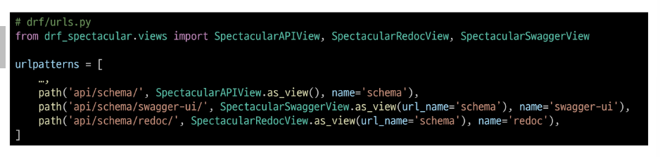

## API 문서화
### OpenAPI Specification (OAS)
- RESTful API를 설명하고 시각화하는 표준화된 방법
- API에 대한 세부사항을 기술할 수 있는 공식 표준

### OAS 기반 API에 대한 문서를 생성하는 데 도움을 주는 오픈소스 프레임워크

## 문서화 활용
### drf-spectacular 라이브러리
- DRF 위한 OpenAPI 3.0 구조 생성을 도와주는 라이브러리
- 설치 및 등록

- 관련 설정 코드 입력 (OpenAPI 구조 자동 생성 코드)

- swagger, redoc 페이지 제공을 위한 url 작성

- http://127.0.0.1:8000/api/schema/swagger-ui/ 페이지 확인
- http://127.0.0.1:8000/api/schema/redoc/ 페이지 확인

### "설계 우선" 접근법
- OAS의 핵심 이점
- API를 먼저 설계하고 명세를 작성한 후, 이를 기반으로 코드를 구현하는 방식
- API의 일관성을 유지하고, API 사용자는 더 쉽게 API를 이해하고 사용할 수 있음
- 또한, OAS를 사용하면 API가 어떻게 작동하는지를 시각적으로 보여주는 문서를 생성할 수 있으며, 이는 API를 이해하고 테스트하는 데 매우 유용
- 이런 목적으로 사용되는 도구가 Swagger-UI 또는 ReDoc