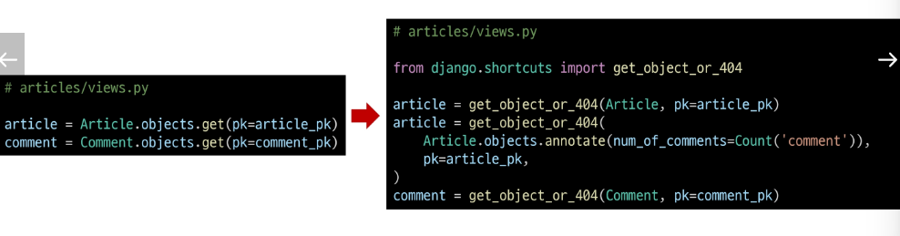
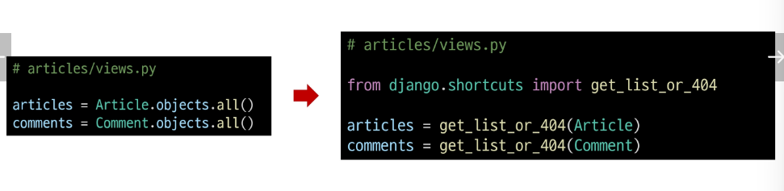

## 올바르게 404 응답하기
### Django shortcuts functions
- render()
- redirect()
- get_object_or_404()
- get_list_or_404()

#### get_object_or_404()
- 모델 manager objects에서 get()을 호출하지만, 해당 객체가 없을 땐 기존 DoesNotExist 예외 대신 Http404를 raise함

##### get_object_or_404 적용

#### get_list_or_404()
- 모델 manager objects에서 filter()의 결과를 반환하고, 해당 객체 목록이 없을 땐 Http404를 raise 함

##### get_list_or_404 적용

### 작용 전/후 비교
- 존재하지 않는 게시글 조회 시 이전에는 상태 코드 500을 응답했지만 현재는 404를 응답

### 왜 사용해야 할까?
- 클라이언트에게 "서버에 오류가 발생하여 요청을 수행할 수 없다(500)" 라는 원인이 정확하지 않은 에러를 제공하기 보다는, 적절한 예외 처리를 통해 클라이언트에게 보다 정확한 에러 현황을 전달하는 것도 매우 중요한 개발 요소 중 하나이기 때문

## View와 Serializer의 역할
- DRF에서는 비즈니스 로직(데이터 가공, annotate, 필터링)을 view나 queryset 로직에서 처리하고, serializer는 그 결과물을 직렬화하는 역할에 집중하는 것이 일반적인 권장사항
- 복잡한 query나 로직은 View 함수에서 진행
  - 여러 모델을 조인하거나 복잡한 집계가 필요한 경우 View 함수에서 처리
  - 필요한 경우 View 함수에서 select_related()나 prefetch_related()를 사용하여 query를 최적화

## DRF 학습 이유
- 백엔드와 프론트엔드의 분리 경험
  - 기존 Django 템플릿 기반의 서버 렌더링 방식을 벗어나, 백엔드(데이터/로직)와 프론트엔드(UI)를 명확히 분리하는 패턴을 간접적으로 체험
- 표준화된 API 구축 역량 확보
  - DRF를 통해 RESTful API를 손쉽게 만들고 관리하는 방법을 학습했는데, 이는 다양한 클라이언트(웹, 모바일 앱, 외부 서비스)와 연동하는 데 필수적인 능력
- 프론트엔드 기술과의 연결 고리
  - 앞으로 학습할 Javascript 및 Vue는 주로 API를 통해 데이터를 받아와 화면을 구성함
  - DRF로 구축한 일관된 API는 Vue등 프론트엔드 프레임워크와 매끄럽게 호환됨