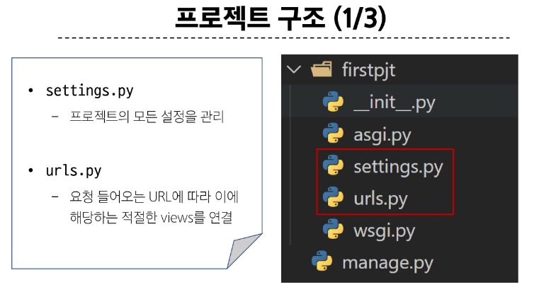
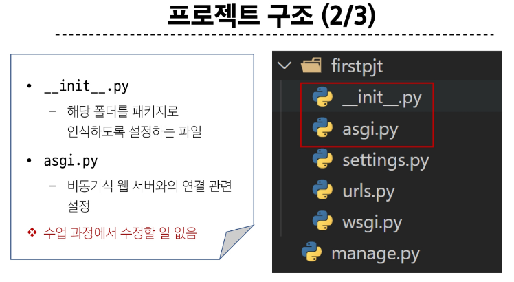
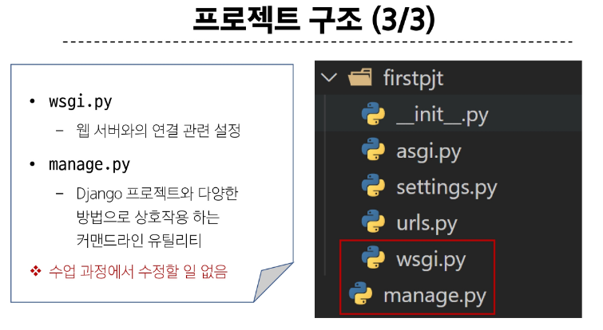
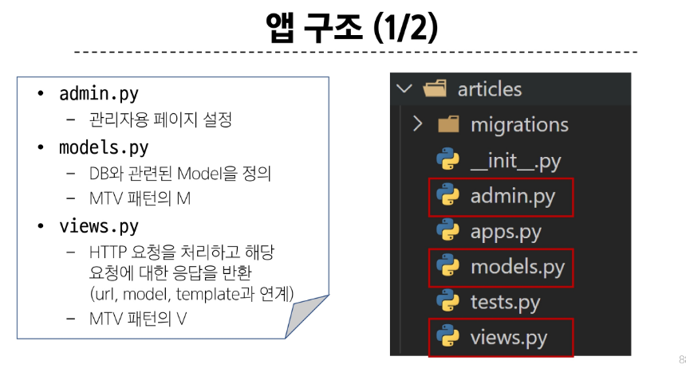
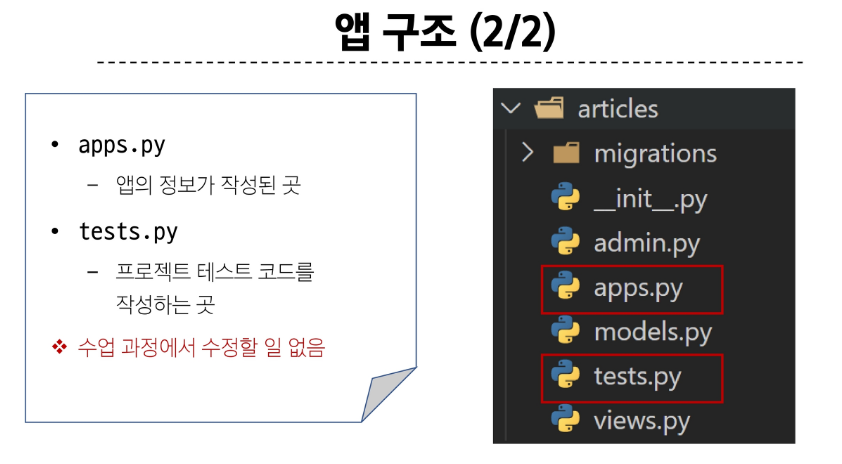

## Django Project
- 애플리케이션의 집합(DB 설정, URL 연결, 전체 앱 설정 등을 처리)

## Django application
- 독립적으로 작동하는 기능 단위 모듈
- (각자 특정한 기능을 담당하며 다른 앱들과 함께 하나의 프로젝트를 구성)

### 앱을 사용하기 위한 순서
1. 앱 생성
- 앱의 이름은 '복수형'으로 지정하는 것을 권장
~~~
$ python manage.py startapp articles
~~~

2. 앱 등록
- 반드시 앱을 생성(1)한 후에 등록(2)해야 함
- (등록 후 생성은 불가능)

## 프로젝트 및 앱 구조
### 프로젝트 구조

### 앱구조

