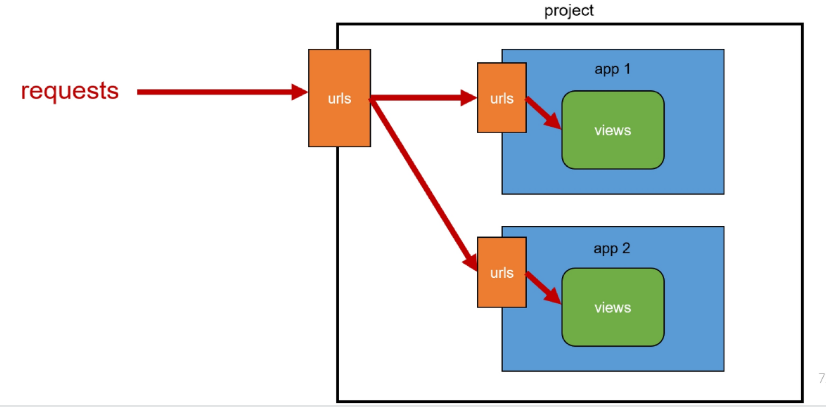

## 요청과 응답에서 Django URLs의 역할

### URL dispatcher(운항 관리자, 분배기)
- URL 패턴을 정의하고 해당 패턴이 일치하는 요청을 처리할 view 함수를 연결(매핑)

## Variable Routing
### 현재 URL 관리의 문제점
- 템플릿의 많은 부분이 중복되고, URL의 일부만 변경되는 상황이라면 계속해서 비슷한 URL과 템플릿을 작성해 나가야 할까?

### Variable Routing
- variable: 변수, routing: 경로
- URL 일부에 변수를 포함시키는 것(변수는 view 함수의 인자로 전달할 수 있음)

#### Variable Routing 작성법
<path_converter:variable_name>
- path_converter에는 타입
- variable_name에는 변수명
~~~python
path('articles/<int:num>/', views.detail)
path('hello/<str:name>/', views.greeting)
~~~

### Path converters
- URL 변수의 타입을 지정(str, int 등 5가지 타입 지원)

#### Variable routing 실습
~~~python
# urls.py

urlpatterns = [
    path('articles/<int:num>/', views.detail),
]
~~~

~~~python
# views.py

def detail(request, num):
    context = {
        'num' : num,
    }
    return render(request, 'articles/detail.html', context)
~~~

~~~html
<!-- articles/detail.html -->



    <h1>Detail</h1>
    <h3>{{ num }}번 글 입니다.</h3>

~~~

## App URL 정의
### App URL mapping
- 각 앱에 URL을 정의하는 것
=> 프로젝트와 각 앱이 URL을 나누어 관리를 편하게 하기 위함

### 2번째 앱 pages 생성 후 발생할 수 있는 문제
- view 함수 이름이 같거나 같은 패턴의 URL 주소를 사용하게 되는 경우
- 아래 코드와 같이 해결해 볼 수 있으나 더 좋은 방법이 필요
=> "URL을 각자 app에서 관리하자"
~~~python
# firstpjt/urls.py

from articles import views as articles_views
from pages import views as pages_views

urlpatterns = [
    ...,
    path('pages', pages_views.index),
]
~~~

#### 기존 url 구조

#### 변경된 url 구조

#### url 구조 변화
~~~python
# firstpjt/urls.py

from django.urls import path, include

urlpatterns = [
    path('admin/', admin.site.urls),
    path('articles/', include('articles/urls')),
    path('pages/', include('pages/urls')),
]
~~~

~~~python
# articles/urls.py

from django.urls import path
from . import views

urlpatterns = [
    path('index/', views.index),
    path('dinner/', views.dinner),
    path('search/', views.search),
    path('throw/', views.throw),
    path('catch/', views.catch),
    path('<int:num>', views.detail),
    path('hello/<str:name>', views.greeting),
]
~~~

~~~python
# pages/urls.py

from django.urls import path
from . import views

urlpatterns = [
    path('index/', views.index)
]
~~~

### include()
- 프로젝트 내부 앱들의 URL을 참조할 수 있도록 매핑하는 함수
=> URL의 일치하는 부분까지 잘라내고, 남은 문자열 부분은 후속 처리를 위해 include된 URL로 전달

### include 적용
~~~python
# firstpjt/urls.py

from django.urls import path, include

urlpatterns = [
    path('admin/', admin.site.urls),
    path('articles/', include('articles.urls')),
    path('pages/', include('pages.url')),
]
~~~
