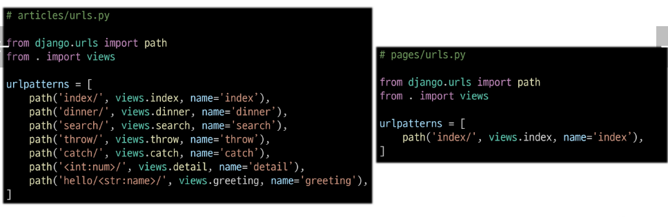
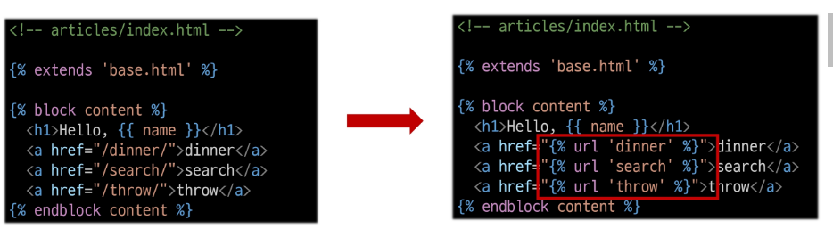
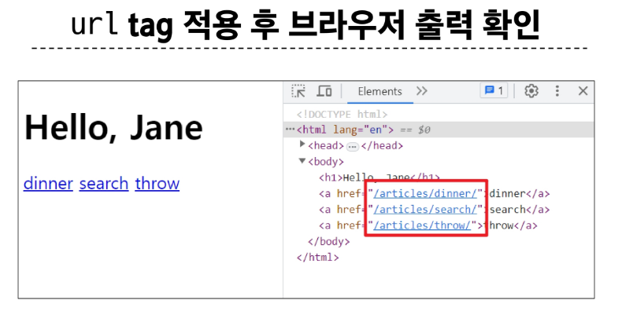

## Naming URL patterns
- URL에 이름을 지정하는 것(path 함수의 name 인자를 정의해서 사용)

### url 구조 변경에 따른 문제점
- 기존 'articles/' 주소가 'articles/index/'로 변경됨에 따라 해당 url을 사용하는 모든 위치를 찾아가 변경해야 함
- 'URL에 이름을 지어주면 이름만 기억하면 되지 않을까?"

~~~python
# firstpjt/urls.py

path('articles/', include('articles.urls'))
~~~

~~~python
# articles/urls.py

path('index/', views.index, name='index') # path 함수에 세번째 인자에 name을 주면 url 주소를 굳이 외우지 않아도 됨
~~~

### Naming URL patterns 적용
- path 함수의 name 키워드 인자를 정의

### URL 표기 변화
- url을 작성하는 모든 곳에서 변경(a 태그의 href 속성 값 뿐만 아니라 form의 action 속성 등도 포함)

## DTL URL tag
### 'url' tag
~~~

~~~
- 주어진 URL 패턴의 이름과 일치하는 절대 경로 주소를 반환

