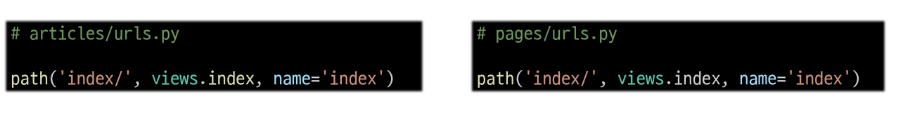
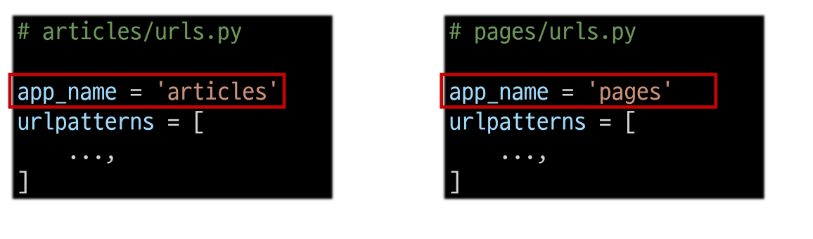

## app_name 속성
### URL 이름 지정 후 남은 문제
- articles 앱의 url 이름과 pages 앱의 url 이름이 같은 상황

- 단순히 이름만으로는 완벽하게 분리할 수 없음
=> "이름에 성(key)을 붙이자"

### 'app_name' 속성 지정
- app_name 변수 값 설정
- 무조건 'app_name'으로 사용하여야 함

### URL tag의 최종 변화
- 마지막으로 url 태그가 사용하는 모든 곳의 표기 변경하기
~~~

~~~

