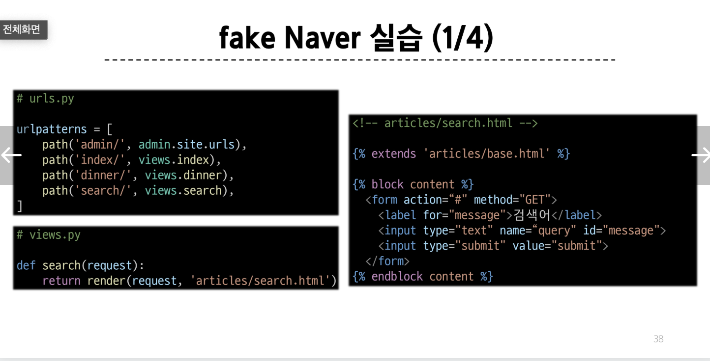
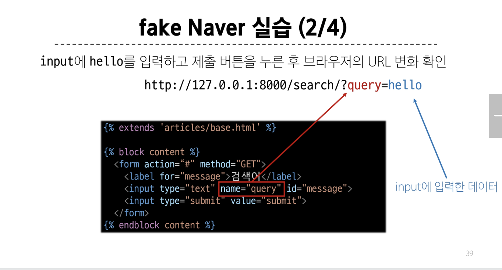
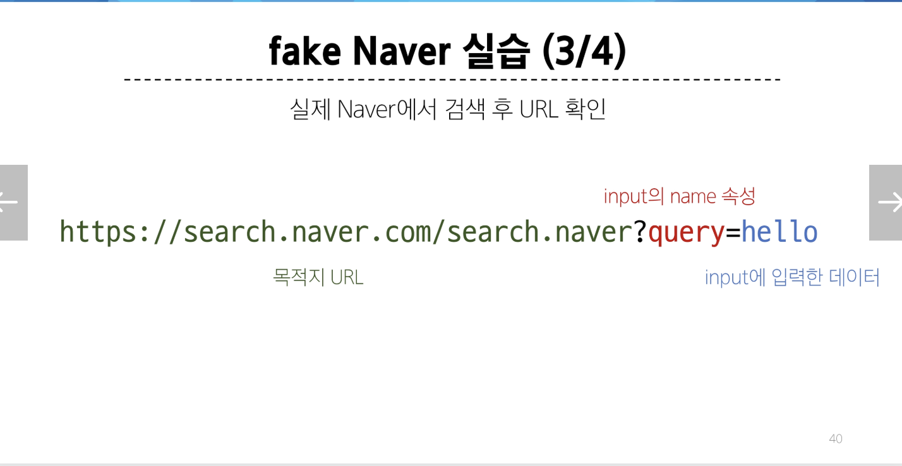
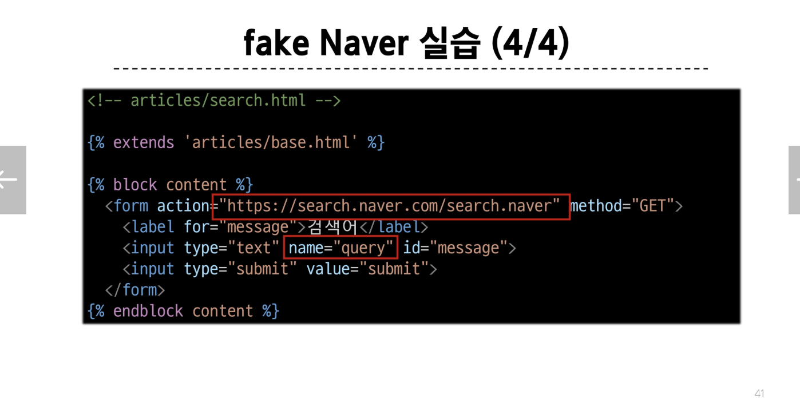
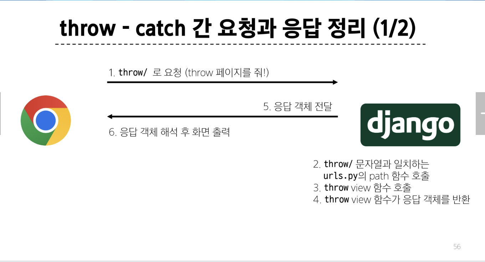
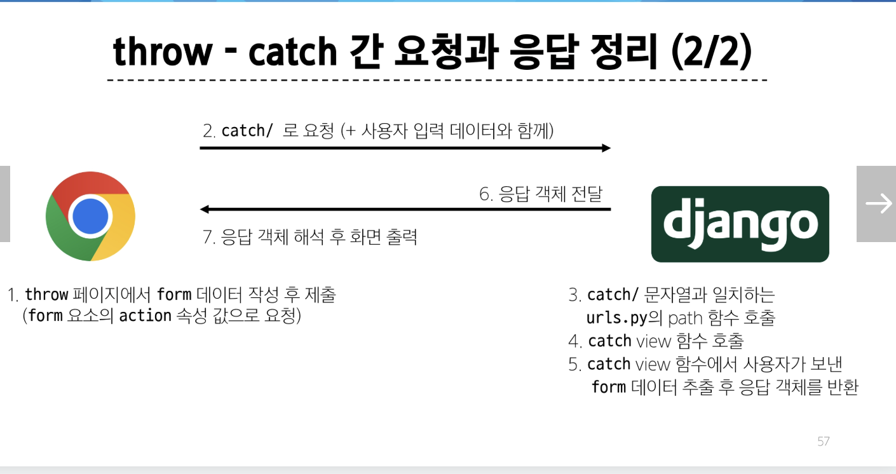

## HTML form
### 데이터를 보내고 가져오기
- HTML 'form' element를 통해 사용자와 애플리케이션 간의 상호작용 이해하기
- HTML 'form'은 HTTP 요청을 서버에 보내는 가장 편리한 방법
~~~html
<form action="#" method="GET">
    

        <label for="name">아이디 : </label>
        <input type="text" id="name">
    

    

        <label for="password">패스워드 : </label>
        <input type="password" name="password" id="password">
    

    <input type="submit" value="로그인">
</form>
~~~

### 'form' element
- 사용자로부터 할당된 데이터를 서버로 전성
=> 웹에서 사용자 정보를 입력하는 여러 방식(text, password, checkbox 등)을 제공

## HTML form 핵심 속성
### 'action' & 'method'
- 데이터를 어디(action)로 어떤 방식(method)으로 요청할지

#### action
- 입력 데이터가 전송될 URL을 지정 (목적지)
- 만약 이 속성을 지정하지 않으면 데이터는 현재 form이 있는 페이지의 URL로 보내짐

#### method
- 데이터를 어떤 방식으로 보낼 것인지 정의
- 데이터의 HTTP request methods (GET, POST)를 지정

### 'input' element
- 사용자의 데이터를 입력 받을 수 있는 요소
- (type 속성 값에 따라 다양한 유형의 입력 데이터를 받음)
=> 핵심 속성 - 'name'

### 'name' attribute
- input의 핵심 속성
- 사용자가 입력한 데이터에 붙이는 이름(key)
- 데이터를 제출했을 때 서버는 name 속성에 설정된 값을 통해서만 사용자가 입력한 데이터에 접근할 수 있음

### Query String Parameters
- 사용자의 입력 데이터를 URL 주소에 파라미터를 통해 서버로 보내는 방법
- 문자열은 앰퍼샌드('&')로 연결된 key=value 쌍으로 구성되며, 기본 URL과는 물음표('?')로 구분됨
- 예시
    - http://host:port/path?key=value&key=value

## HTML form 활용
### HTTP request 객체
- form으로 전송한 데이터 뿐만 아니라 Django로 들어오는 모든 요청 관련 데이터가 담겨 있음(view 함수의 첫번째 인자로 전달됨)

1. throw 로직 작성
~~~python
# urls.py

urlpatterns = [
    path('throw/', views.throw),
]
~~~

~~~python
# views.py

def throw(request):
    return render(request, 'articles/throw.html')
~~~

~~~html
<!-- articles/throw.html -->
 

 
    <h1>Throw</h1>
    <form action="/catch/" method="GET">
        <input type="text" id="message" name="message">
        <input type="submit">
    </form>

~~~

2. catch 로직 작성
- throw 페이지에서 요청한 사용자 입력 데이터는 어떻게 가져와야 할까?
~~~python
# urls.py

urlpatterns = [
    path('catch/', views.catch),
]
~~~

~~~python
# views.py

def catch(request):
    context = ???
    return render(request, 'articles/catch.html')
~~~

~~~html
<!-- articles/catch.html -->




    <h1>Catch</h1>
    <h3>{{ ??? }}를 받았습니다!</h3>

~~~

### HTTP request 객체
- form으로 전송한 데이터 뿐만 아니라 Django로 들어오는 모든 요청 관련 데이터가 담겨 있음(view 함수의 첫번째 인자로 전달됨)

### request 객체에서 form 데이터 추출
~~~
request.GET.get('message')
<!-- 딕셔너리의 get 메서드를 사용해 키의 값을 조회 -->
~~~

3. catch 로직 마무리
~~~python
# views.py

def catch(request):
    message = request.GET.get('message')
    context = {
        'message': message,
    }
    return render(request, 'articles/catch.html', context)
~~~

~~~html
<!-- articles/catch.html -->




    <h1>Catch</h1>
    <h3>{{ message }}를 받았습니다/!</h3>

~~~

### throw - catch 간 요청과 응답 정리

