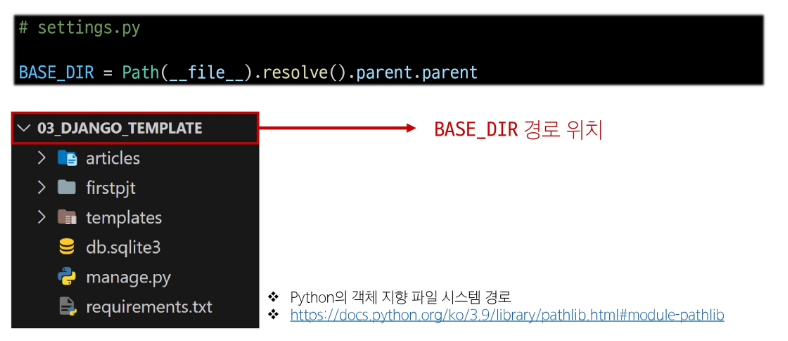

## 추가 템플릿 경로
### 추가 템플릿 경로 지정
- 템플릿 기본 경로 외 커스텀 경로 추가하기

### BASE_DIR
- settings에서 경로지정을 편하게 하기 위해 최상단 지점을 지정해 둔 변수

## DTL 주의사항
- Python처럼 일부 프로그래밍 구조(if, for등)를 사용할 수 있지만 명칭을 그렇게 설계 했을 뿐이지 Python 코드로 실행되는 것이 아니며 Python과는 관련 없음
- 프로그래밍적 로직이 아니라 표현을 위한 것임을 명심하기
- 프로그래밍적 로직은 되도록 view 함수에서 작성 및 처리할 것
- 공식문서를 참고해 다양한 태그와 필터 사용해보기
    - https://docs.djangoproject.com/en/4.2/ref/templates/builtins/

## Trailing Slashes
### URL의 Trailing Slashes
- Django는 URL 끝에 '/'가 없다면 자동으로 붙임
- "기술적인 측면에서, foo.com/bar와 foo.com/bar/는 서로 다른 URL"
    - 검색 엔진 로봇이나 웹 트래픽 분석 도구에서는 이 두 주소를 서로 다른 페이지로 보기 때문

- 그래서 Django는 검색 엔진이 혼동하지 않게 하기 위해 무조건 붙이는 것을 선택하는 것
- 그러나 모든 프레임워크가 이렇게 동작하는 것은 아니니 주의
