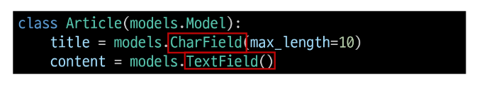
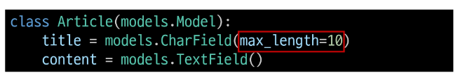

## Model Field
- DB 테이블의 필드(열)을 정의하며, 해당 필드에 저장되는 데이터 타입(Field types)과 제약조건(Field options)을 정의

### Model Field 구성
1. Field types(필드 유형)
- 데이터베이스에 저장될 "데이터의 종류" 를 정의

2. Field options(필드 옵션)
- 필드의 "동작"과 "제약 조건"을 정의

## Field types
- 데이터베이스에 저장될 "데이터의 종류"를 정의(models 모듈의 클래스로 정의되어 있음)

### CharField()
- 제한된 길이의 문자열을 저장(필드의 최대 길이를 결정하는 max_length는 필수 옵션)

### TextField()
- 길이 제한이 없는 대용량 텍스트를 저장(무한대는 아니며 사용하는 시스템에 따라 달라짐)

### 주요 필드 유형
- 문자열 필드
    - CharField
    - TextField

- 숫자 필드
    - IntegerField
    - FloatField

- 날짜/시간 필드
    - DateField
    - TimeField
    - DateTimeField

- 파일 관련 필드
    - FileField
    - ImageField

## Field options
- 필드의 "동작"과 "제약 조건"을 정의

### 제약조건(Constraint)
- 특정 규칙을 강제하기 위해 테이블의 열이나 행에 적용되는 규칙이나 제한사항
=> ex) 숫자만 저장되도록, 문자가 100자 까지만 저장되도록 하는 등

### 주요 필드 옵션
- null
    - 데이터베이스 NULL 값을 허용할지 여부를 결정(기본값: False)

- blank
    - form에서 빈 값을 허용할지 여부를 결정(기본값: False)

- default
    - 필드의 기본값을 설정