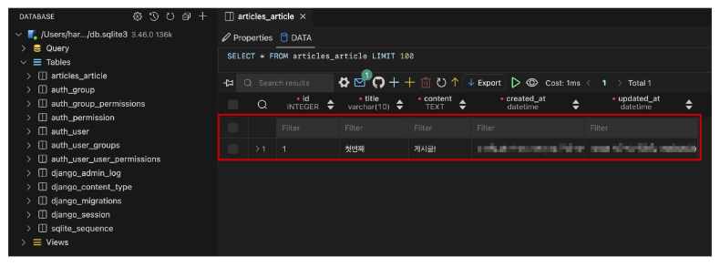

## 관리자 인터페이스
### Automatic admin interface
- Django가 추가 설치 및 설정 없이 자동으로 제공하는 관리자 인터페이스
- 데이터 확인 및 테스트 등을 진행하는데 매우 유용

#### 1. admin 계정 생성
- email은 선택사항이기 때문에 입력하지 않고 진행 가능
- 비밀번호 입력 시 보안상 터미널에 출력되지 않으니 무시하고 입력 이어가기
~~~bash
$ python manage.py createsuperuser
~~~

#### 2. DB에 생성된 admin 계정 확인

#### 3. admin에 모델 클래스 등록
- admin.py에 작성한 모델 클래스를 등록해야만 admin site에서 확인 가능
~~~python
# articles/admin.py

from django.contrib import admin
from .models import Article

admin.site.register(Article)
~~~

#### 4. admin site 로그인 후 등록된 모델 클래스 확인

#### 5. 데이터 생성, 수정, 삭제 테스트

#### 6. 테이블 확인

