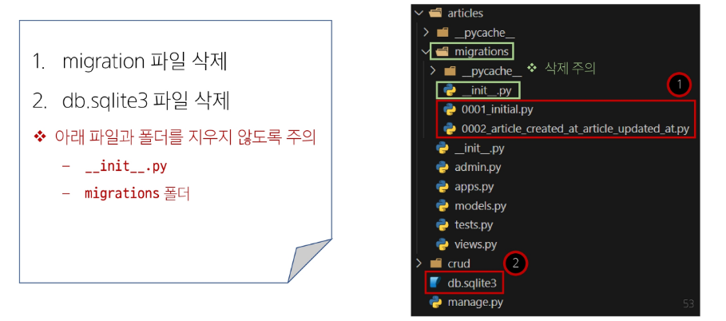
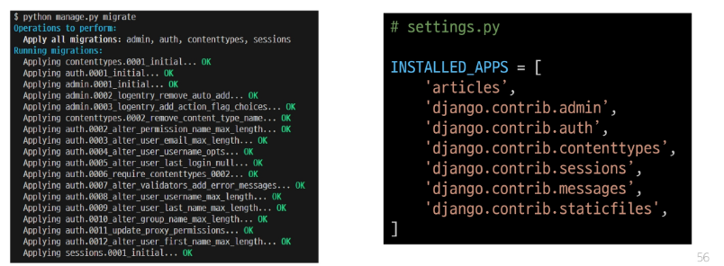

## 데이터베이스 초기화

## Migrations 관련
### Migrations 기타 명령어
~~~bash
$ python manage.py showmigrations
~~~
- migrations 파일들이 migrate 됐는지 안됐는지 여부를 확인하는 명령어
- [X] 표시가 있으면 migrate가 완료되었음을 의미

~~~bash
$ python manage.py sqlmigrate articles 0001
~~~
- 해당 migrations 파일이 SQL 언어(DB에서 사용하는 언어)로 어떻게 번역되어 DB에 전달되는지 확인하는 명령어

### 첫 migrate 시 출력 내용이 많은 이유는?
- Django 프로젝트가 동작하기 위해 미리 작성 되어있는 기본 내장 app들에 대한 migration 파일들이 함께 migrate 되기 때문

## SQLite
- 데이터베이스 관리 시스템 중 하나이며 Django의 기본 데이터베이스로 사용됨(파일로 존재하며 가볍고 호환성이 좋음)