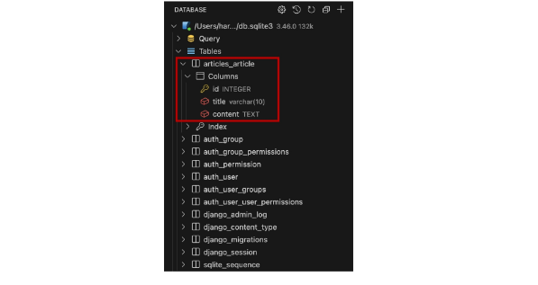
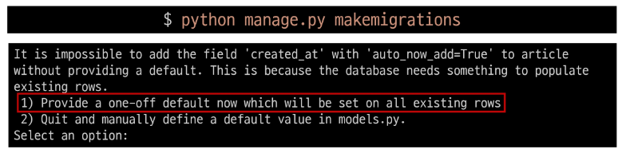
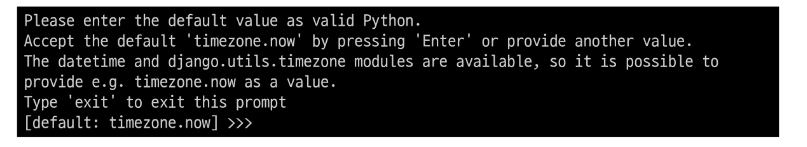
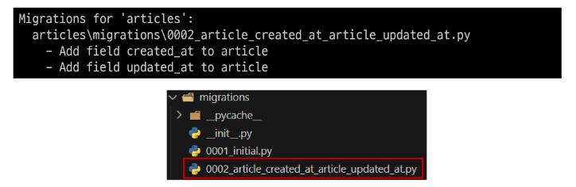
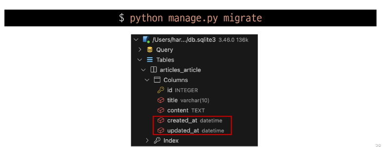

## Migrations
- model 클래스의 변경사항(필드 생성, 수정, 삭제 등)을 DB에 최종 반영하는 방법

### Migrations 과정

### Migrations 핵심 명령어 2가지
~~~bash
$ python manage.py makemigrations
~~~
- model class를 기반으로 최종 설계도(migration) 작성

~~~bash
$ python manage.py migrate
~~~
- 최종 설계도를 DB에 전달하여 반영

### migrate 후 DB 내에 생성된 테이블 확인
- Article 모델 클래스로 만들어진 articles_article 테이블

## 추가 Migrations
### 이미 생성된 테이블에 필드를 추가해야 한다면?
#### 추가 모델 필드 작성 1
~~~python
# articles/models.py

class Article(models.Model):
    title = models.CharField(max_length=10)
    content = models.TextField()
    created_at = models.DateTimeField(auto_now_add=True)  # 추가
    update_at = models.DateTimeField(auto_now=True)  # 추가
~~~

##### DateTimeField의 필드 옵션(optional)
auto_now 
- 데이터가 저장될 때마다 자동으로 현재 날짜시간을 저장

auto_now_add 
- 데이터가 처음 생성될 때만 자동으로 현재 날짜시간을 저장

#### 추가 모델 필드 작성 2
- 이미 기존 테이블이 존재하기 때문에 필드를 추가 할 때 필드의 기본 값 설정이 필요
- 1번은 현재 대화를 유지하면서 직접 기본 값을 입력하는 방법
- 2번은 현재 대화에서 나간 후 models.py에 기본 값 관련 설정을 하는 방법

#### 추가 모델 필드 작성 3
- 추가하는 필드의 기본 값을 입력해야 하는 상황
- 날짜 데이터이기 때문에 직접 입력하기 보다 Django가 제안하는 기본 값을 사용하는 것을 권장
- 아무것도 입력하지 않고 enter를 누르면 Django가 제안하는 기본 값으로 설정 됨

#### 추가 모델 필드 작성 4
- migrations 과정 종료 후 2번째 migration 파일이 생성됨을 확인
- 이처럼 Django는 설계도를 쌓아가면서 추후 문제가 생겼을 시 복구하거나 되돌릴 수 있도록 함(마치 'git commit'과 유사)

#### 추가 모델 필드 작성 5
- migration 후 테이블 빌드 변화 확인

### model class에 변경사항(1)이 생겼다면, 반드시 새로운 설계도를 생성(2)하고, 이를 DB에 반영(3)해야 함
model class 변경 -> makemigrations -> migrate
