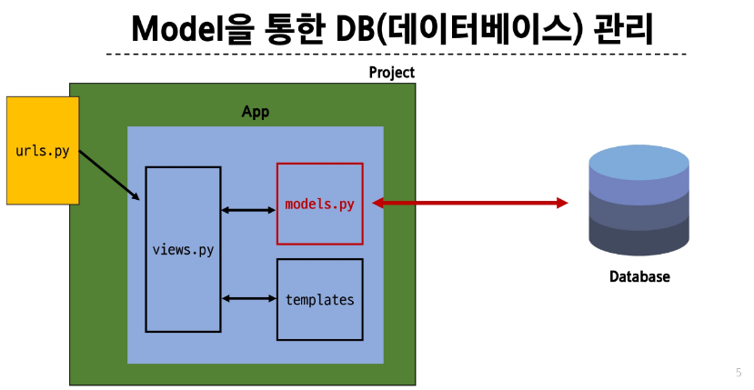
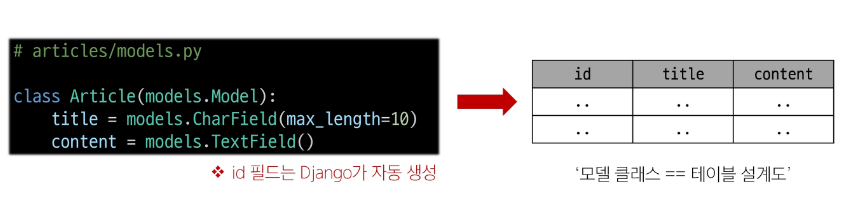
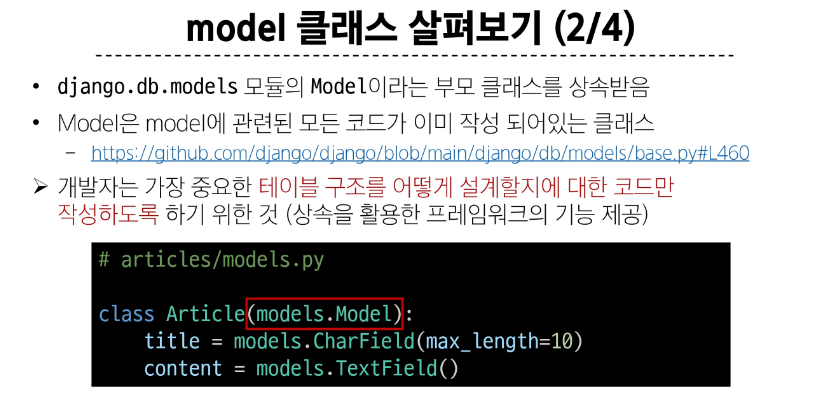
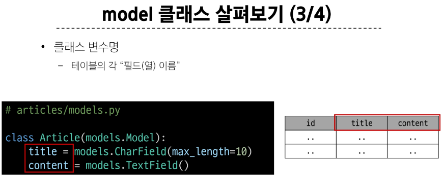
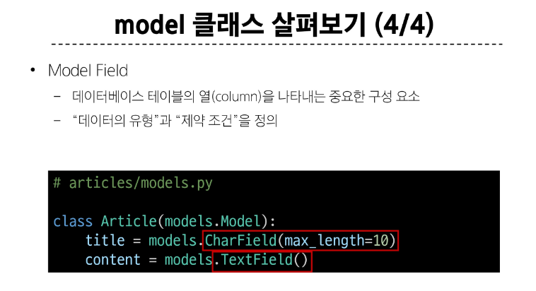

## Model을 통한 DB(데이터베이스) 관리

### Django Model
- DB의 테이블을 정의하고 데이터를 조작(CRUD)할 수 있는 기능들을 제공
=> 테이블 구조를 설계하는 '청사진(blueprint)'

 ### model 클래스 작성
 ~~~python
# articles/models.py

class Article(models.Model):
    title = models.CharField(max_length=10)
    content = models.TextField()
 ~~~

### model 클래스 살펴보기
#### 1.
 - 작성한 모델 클래스는 최종적으로 DB에 다음과 같은 테이블 구조를 만듦

#### 2.

- 개발자는 가장 중요한 테이블 구조를 어떻게 설계할지에 대한 코드만 작성하도록 하기 위한 것 (상속을 활용한 프레임워크의 기능 제공)

#### 3.

#### 4.

